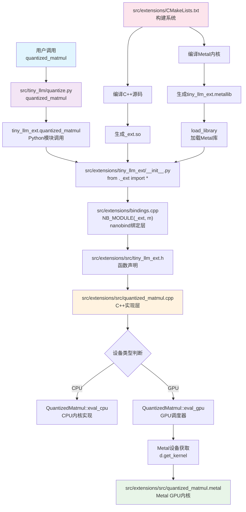

MLX是苹果公司发布的一个专为Apple Silicon设计的机器学习框架。与PyTorch、JAX类似，MLX提供了类似NumPy的API，支持自动微分，但其独特之处在于针对苹果M系列芯片进行了深度优化。MLX能够充分利用M芯片的统一内存架构，让CPU和GPU无缝共享内存，避免了传统架构中昂贵的内存拷贝开销。Metal是苹果的低级GPU编程接口，类似于CUDA之于NVIDIA或OpenCL之于通用GPU计算。Metal允许开发者直接访问Apple Silicon的GPU资源，编写高性能的并行计算代码。在MLX中，许多计算密集型操作（如矩阵乘法、卷积等）都通过Metal内核实现，以获得最佳性能。

量化则是大语言模型部署中的关键技术，通过将模型权重从FP16/FP32精度降低到INT4/INT8，可以显著减少内存占用和计算量。在本文中，我们将学习如何从零开始实现一个MLX量化矩阵乘法扩展，包括CPU和Metal GPU两个版本的实现。

首先，我们以在MLX框架中实现的大语言模型[Qwen/Qwen2-7B-Instruct-MLX](https://huggingface.co/Qwen/Qwen2-7B-Instruct-MLX)为切入点，深入学习大模型中量化技术的核心算法原理。接下来，我们基于[tiny-llm](https://github.com/skyzh/tiny-llm)， 逐步构建完整的实现框架：从Python层面的MLX接口开始，通过nanobind桥接到C++后端，最终分别在CPU和Metal GPU上实现高效的量化矩阵乘法算法。

# 大模型中的分组量化技术

以[Qwen/Qwen2-7B-Instruct-MLX](https://huggingface.co/Qwen/Qwen2-7B-Instruct-MLX)为例，打开其配置文件[config.json](https://huggingface.co/Qwen/Qwen2-7B-Instruct-MLX/blob/main/config.json)，可以看到如下的量化相关配置：
```json
    "quantization": {
        "group_size": 64,
        "bits": 4
    },
```
这个配置说明这个模型使用的是常见的分组量化技术。分组量化是一种常见的神经网络权重量化方法。其核心思想是：**将权重矩阵按照行（或列）划分为若干个大小相同的分组（group），每个分组内独立地进行量化参数（如scale和bias）的计算和量化编码**。
以4位分组量化为例，假设group_size=64，表示每64个权重为一组。对于每一组，分别计算该组的最大最小值（或均值、方差等），据此确定该组的scale（缩放因子）和bias（零点偏移），然后将该组的浮点权重映射为4位整数（通常是0~15的范围）。这样做的好处是：**每组都能自适应地调整量化区间，显著降低量化误差**，比全局统一量化更精细，能更好地兼顾模型精度和存储/计算效率。
在实际部署时，解码时只需用每组的scale和bias将4位整数还原为近似的浮点数即可。分组量化广泛应用于大语言模型（LLM）推理加速，尤其是在INT4/INT8等低比特量化场景下，能有效提升模型的推理速度和内存利用率，同时保持较高的精度。

MLX 中的 [`mlx.core.quantize`](https://ml-explore.github.io/mlx/build/html/python/_autosummary/mlx.core.quantize.html) 提供了一个简洁高效的分组量化实现，其接口如下：

```python
quantize(w: array,
        group_size: int = 64,
        bits: int = 4,
        *,
        stream: None | Stream | Device = None
) -> tuple[array, array, array]
```
在量化过程中，矩阵 $w$ 的每一行会按照 group_size 进行分组，每组包含 $w_1, \ldots, w_g$ 这 $g$ 个元素。对于每一组，我们分别计算该组元素的最大值和最小值，然后将区间 $[\beta, \alpha]$ 均匀划分为 $2^{bits}-1$ 个子区间。具体公式如下：

$$
\begin{align}
\alpha &= \max_{i} g_i \\
\beta &= \min_{i} g_i \\
s & = \frac{\alpha-\beta}{2^b-1} \\
\hat{w_i} &= \mathrm{round}\left(\frac{w_i-\beta}{s}\right) \\
\end{align}
$$

此时，每个 $\hat{w}_i$ 都可以用 $b$ 个比特表示。为了节省存储空间，通常会将多个 $\hat{w}_i$ 打包存储在同一个 uint32 整数中。

最终，量化操作会输出三个结果：
* $w_q$：量化后的权重
* scales：每组的 $s$
* bias：每组的 $\beta$

目前，mlx 的量化仅支持二维矩阵。

对应的反量化操作由 [mlx.core.dequantize](https://ml-explore.github.io/mlx/build/html/python/_autosummary/mlx.core.dequantize.html#) 实现，过程非常直接：

$$
w_i = s \hat{w}_i + \beta
$$


除了前面介绍的量化与反量化操作，MLX 还提供了一个高效的接口用于实现普通矩阵与量化矩阵的乘法：[mlx.core.quantized_matmul](https://ml-explore.github.io/mlx/build/html/python/_autosummary/mlx.core.quantized_matmul.html)。其函数签名如下：
```python
quantized_matmul(
    x: array,
    w: array,
    scales: array,
    biases: array,
    transpose: bool = True,
    group_size: int = 64,
    bits: int = 4,
    *,
    stream: None | Stream | Device = None
) -> array
```
该函数用于执行带有普通矩阵x和量化权重矩阵 w 的高效矩阵乘法。量化方式为每 group_size 个元素分配一组浮点 scale 和 bias，每个权重元素用 bits 位表示，并以无符号 32 位整数形式打包存储。

假设我们将 `transpose` 参数设为 `True`（这也是神经网络矩阵乘法的常见配置），并采用 4 位量化方式，此时一个 uint32 可以存储 8 个 4 位量化值。设 w 矩阵的尺寸为 $N \times M$，量化前的 $w^{org}$ 矩阵尺寸为 $K \times M$，我们希望计算 $x @ w_{org}^T$。在这种情况下，`quantized_matmul` 函数中各参数的尺寸如下所示：

| 参数       | 尺寸                              |
|------------|-----------------------------------|
| x          | $N \times M$                      |
| w          | $K \times M / 8$                  |
| group_size | 64                                |
| bits       | 4                                 |
| scales     | $K \times M / \text{group\_size}$ |
| biases     | $K \times M / \text{group\_size}$ |

根据广播机制，x可以不是二维的，但是目前MLX里只支持w是二维的情况（这也是神经网络里面大部分出现的情况）。
因此，我们的目标是实现与 [`mlx.core.quantized_matmul`](https://ml-explore.github.io/mlx/build/html/python/_autosummary/mlx.core.quantized_matmul.html) 等价的功能，并通过[如下单元测试](https://github.com/magic3007/tiny-llm/blob/cd5445923a66a4a141d06c4f97aba68affc8ceee/testssol/test_week_2_day_2.py#L7)进行验证。只需将你的实现结果与官方 `mlx.core.quantized_matmul` 的输出进行对比即可。

```python
import pytest
import mlx.core as mx
from .tiny_llm_base import *
from .utils import *


def quantized_matmul_helper(
    stream: mx.Stream, identity_matrix: bool, precision: mx.Dtype
):
    with mx.stream(stream):
        if identity_matrix:
            input = mx.eye(64, dtype=precision)
        else:
            input = mx.random.normal(shape=(3, 64), dtype=precision)
        weight = mx.random.normal(shape=(5, 64), dtype=precision)
        w_q, scales, biases = mx.quantize(weight)
        user_out = quantized_matmul(
            scales=scales,
            biases=biases,
            group_size=64,
            bits=4,
            a=input,
            b=w_q,
            transpose_b=True,
        )
        ref_out = mx.quantized_matmul(
            input,
            w_q,
            scales,
            biases,
            group_size=64,
            bits=4,
            transpose=True,
        )
        assert_allclose(user_out, ref_out, precision)
```

# Custom Extensions in MLX

本章节将介绍如何在MLX中自定义算子，涵盖从Python接口到CPU与Metal后端的完整实现方案。整理实现方案见下：



## Python用户接口层

首先，我们来看用户接口层。假设已经有一个 Python 模块 `extensions.tiny_llm_ext`，其中实现了输入 a 为二维时的 `quantized_matmul`。在用户接口层，我们会将所有输入情况统一转换为 a 为二维的形式，从而简化后续的处理逻辑。

文件：[src/tiny_llm/quantize.py](https://github.com/magic3007/tiny-llm/blob/mj/dev/src/tiny_llm/quantize.py)
```python
import mlx.core as mx
from typing import Any
from extensions import tiny_llm_ext

def quantized_matmul(
    scales: mx.array,
    biases: mx.array,
    group_size: int,
    bits: int,
    a: mx.array,
    b: mx.array,
    transpose_b: bool = False,
) -> mx.array:
    *N, D = a.shape
    a = a.reshape(-1, D)
    a = mx.contiguous(a)
    b = mx.contiguous(b)
    out = tiny_llm_ext.quantized_matmul(
        scales, biases, group_size, bits, a, b, transpose_b
    )
    return out.reshape(*N, -1)

```

## Python模块初始化层

文件路径：[src/extensions/tiny_llm_ext/__init__.py](https://github.com/magic3007/tiny-llm/blob/d09be7b33ca6a3326bacf9f4c4e052bd13d4d497/src/extensions/tiny_llm_ext/__init__.py)

经过后面步骤的编译后，`src/extensions/tiny_llm_ext/` 目录下会生成以下三个文件：
```
_ext.cpython-310-darwin.so
libtiny_llm_ext.dylib
tiny_llm_ext.metallib
```

在该模块的 `__init__.py` 文件中，我们首先通过 `from ._ext import *` 导入 C++ 绑定接口，然后调用 `load_library(mx.gpu, str(current_path))` 加载 Metal 库，以确保自定义算子能够在 GPU 上正确运行。

```python
# Copyright © 2023 Apple Inc.

from pathlib import Path

import mlx.core as mx

try:
    from ._ext import *

    current_path = Path(__file__).parent
    load_library(mx.gpu, str(current_path))
except ImportError:
    print("Failed to load C++/Metal extension"
```

## Python-C++ 绑定层

在 [`src/extensions/bindings.cpp`](https://github.com/magic3007/tiny-llm/blob/d09be7b33ca6a3326bacf9f4c4e052bd13d4d497/src/extensions/bindings.cpp) 文件中，我们采用 nanobind 技术为 C++ 实现的核心函数创建 Python 绑定，使其能够被 Python 端直接调用。这一层的主要作用是将底层 C++ 算子无缝暴露给 Python，方便在高层接口中集成和调用。

```c++
// Copyright © 2023-2024 Apple Inc.

#include <nanobind/nanobind.h>
#include <nanobind/stl/variant.h>

#include "quantized_matmul.h"
#include "tiny_llm_ext.h"

namespace nb = nanobind;
using namespace nb::literals;

NB_MODULE(_ext, m) {
    m.doc() = "tiny-llm extensions for MLX";

    m.def("load_library", &tiny_llm_ext::load_library, "device"_a, "path"_a);

    m.def("quantized_matmul", &tiny_llm_ext::quantized_matmul, "scales"_a, "bia"_a, "group_size"_a, "bits"_a, "a"_a,
          "b"_a, "transpose_b"_a = false, "stream"_a = nb::none(),
          R"(
        Quantized matmul

        Args:
            scales (array): Scaling factors for ``a``.
            biases (array): Biases for ``a``.
            group_size (int): Group size for ``a``.
            bits (int): Number of bits for ``a``.
            a (array): Input array.
            b (array): Input array.
            transpose_b (bool): Whether to transpose ``b`` before multiplication.
            stream (Stream): Stream to use for the operation.

        Returns:
            array: ``a * b``
      )");
}
```
nanobind 是一个高性能的 C++/Python 绑定库，灵感来自 pybind11，但更轻量且兼容性更好。通过这些语法糖，开发者可以方便地将 C++ 高性能算子暴露给 Python，同时保持良好的接口风格和类型安全性。
这里有两个 nanobind 绑定 C++/Python 接口时常见的语法细节：

- `nb::kw_only()` 是 nanobind 提供的关键字参数分隔符，用于指定其后的所有参数在 Python 层必须以关键字方式传递，类似于 Python 函数定义中的 `*`。这样可以提升接口的可读性和安全性，防止参数顺序错误带来的 bug。例如：

  ```c++
  m.def("foo", &foo, "a"_a, nb::kw_only(), "b"_a, "c"_a);
  ```
  在 Python 侧调用时，`a` 可以作为位置参数传递，而 `b` 和 `c` 必须显式写成 `b=...`, `c=...`。

- `_a` 是 nanobind 提供的字面量后缀操作符（literal suffix operator），用于为 C++ 绑定的函数参数指定在 Python 层的参数名。这样，C++ 的参数名就能直接映射为 Python 的关键字参数，提升了接口的直观性。例如：

  ```c++
  m.def("bar", &bar, "x"_a, "y"_a=42);
  ```
  这样在 Python 侧就可以用 `bar(x=1, y=2)` 方式调用。


## C++接口层

接下来是C++ 接口层负责将高性能的底层实现以清晰、类型安全的方式暴露给上层调用。主要涉及的文件包括
- `src/extensions/src/tiny_llm_ext.h`
- `src/extensions/src/quantized_matmul.h`
- `src/extensions/src/utils.cpp`

### Metal的核函数注册机制

在[`utils.cpp`](https://github.com/magic3007/tiny-llm/blob/d09be7b33ca6a3326bacf9f4c4e052bd13d4d497/src/extensions/src/utils.cpp)中，我们提供了辅助函数`load_library`。


- [`src/extensions/src/tiny_llm_ext.h`](https://github.com/magic3007/tiny-llm/blob/d09be7b33ca6a3326bacf9f4c4e052bd13d4d497/src/extensions/src/tiny_llm_ext.h)

```cpp
#pragma once

#include "mlx/ops.h"
#include "mlx/primitives.h"

namespace mx = mlx::core;

namespace tiny_llm_ext {

void load_library(mx::Device d, const char *path);

}
```

- [`src/extensions/src/utils.cpp`](https://github.com/magic3007/tiny-llm/blob/d09be7b33ca6a3326bacf9f4c4e052bd13d4d497/src/extensions/src/utils.cpp)

```cpp
#include "tiny_llm_ext.h"

#ifdef _METAL_
#include "mlx/backend/metal/device.h"
#endif

namespace tiny_llm_ext {

void load_library(mx::Device d, const char *path) {
#ifdef _METAL_
    auto &md = mx::metal::device(d);
    md.register_library("tiny_llm_ext", path);
#endif
}

}

```

与 CUDA 不同，Metal 的 GPU 内核代码（即 .metal 文件编译生成的 metallib 库）并不会被直接嵌入到最终的可执行文件或动态链接库中，而是以独立的二进制文件形式存在。这意味着在运行时，开发者需要显式地将这些 Metal 内核库注册到设备上，才能让框架正确地找到和调度自定义的 GPU 算子。

这样设计的原因主要有两点：一方面，Metal 的内核编译和加载机制本身就是面向动态模块的，便于后续灵活扩展和热更新；另一方面，苹果生态下的安全和沙箱机制也要求开发者对加载的 GPU 代码有更明确的控制权。

```c++

// 可以注册多个不同的库
md.register_library("tiny_llm_ext_ref", "/path/to/ref_library.metallib");
md.register_library("tiny_llm_ext_opt", "/path/to/optimized_library.metallib");
md.register_library("third_party_lib", "/path/to/other_library.metallib");

# md.register_library
# 第一个参数是库的逻辑名称或别名
# 第二个参数是实际的metalib文件路径


// 后续可以从不同库获取内核
auto kernel1 = d.get_kernel("function_a", "tiny_llm_ext_ref");
auto kernel2 = d.get_kernel("function_b", "tiny_llm_ext_opt");
```

相比之下，CUDA 支持三种内核函数的存储和加载方式：最常见的是静态编译（即内核代码直接编译进可执行文件），其次是动态模块加载（类似于 Metal 的注册机制，可以在运行时加载 .cubin 或 .ptx 文件），还有一种是运行时编译（NVRTC，允许在程序运行时动态编译 CUDA 源码）。

因此，在 MLX 等框架中，针对 Metal 后端，必须通过类似 `register_library` 的接口手动注册自定义的 metallib 文件，否则系统无法识别和调用这些自定义 GPU 内核。这种机制虽然增加了一步注册流程，但极大提升了内核管理的灵活性和可扩展性，也便于开发者在同一设备上动态切换、升级不同版本的 GPU 算子库。

### MLX里面的operation和primitive概念
在 [`src/extensions/src/quantized_matmul.h`](https://github.com/magic3007/tiny-llm/blob/d09be7b33ca6a3326bacf9f4c4e052bd13d4d497/src/extensions/src/quantized_matmul.h) 文件中，我们对 MLX 框架中的 operation 和 primitive 进行了分别定义。在 MLX 中，Operation（操作）主要负责确定输入输出数组的形状和数据类型，而 Primitive（原语）则承担在不同设备上执行具体计算的任务。两者分工明确，共同构成了高效且灵活的算子实现体系。

```cpp
#pragma once

#include "mlx/ops.h"
#include "mlx/primitives.h"

namespace mx = mlx::core;

namespace tiny_llm_ext {

///////////////////////////////////////////////////////////////////////////////
// Operation
///////////////////////////////////////////////////////////////////////////////

/**
 *  Quantized matmul
 *
 *  Args:
 *      scales (array): Scaling factors for ``a``.
 *      biases (array): Biases for ``a``.
 *      group_size (int): Group size for ``a``.
 *      bits (int): Number of bits for ``a``.
 *      a (array): Input array.
 *      b (array): Input array.
 *      transpose_b (bool): Whether to transpose ``b`` before multiplication.
 *      s (StreamOrDevice): Stream or device to use for the operation.
 */
mx::array quantized_matmul(const mx::array &scales, const mx::array &biases, const int group_size, const int bits,
                           const mx::array &a, const mx::array &b, const bool transpose_b, mx::StreamOrDevice s = {});

...

```

以 `quantized_matmul` 为例，在[`src/extensions/src/quantized_matmul.cpp`](https://github.com/magic3007/tiny-llm/blob/d09be7b33ca6a3326bacf9f4c4e052bd13d4d497/src/extensions/src/quantized_matmul.cpp)有其实现代码：

```cpp
mx::array quantized_matmul(const mx::array &scales, const mx::array &biases, const int group_size, const int bits,
                           const mx::array &a, const mx::array &b, const bool transpose_b, mx::StreamOrDevice s) {
    if (scales.dtype() != mx::float16 || biases.dtype() != mx::float16) {
        throw std::runtime_error("quantized_matmul: scales and biases must be float16");
    }
    if (b.dtype() != mx::uint32) {
        throw std::runtime_error("quantized_matmul: b must be uint32");
    }
    ...

    auto out_shape = a.shape();
    if (out_shape.size() != 2) {
        throw std::runtime_error("quantized_matmul: a must be a 2D array");
    }
    out_shape[1] = b.shape()[0];

    return mx::array(
        /* const mx::Shape& shape = */ out_shape,
        /* mx::Dtype dtype = */ mx::float16,
        /* std::shared_ptr<mx::Primitive> primitive = */
        std::make_shared<QuantizedMatmul>(to_stream(s), group_size, bits),
        /* const std::vector<mx::array>& inputs = */ {scales, biases, a, b});
}
```

可以看到，operation 主要负责对输入参数的类型和形状进行校验，推断输出张量的形状和数据类型，并最终构造出包含 Primitive 实例的 `mx::array`。

需要注意的是，**operation 本身并不会实际执行计算，也不会为输出分配新的内存, 分配内存是primitive负责的**。

除了这些基本功能外，operation 还承担着类型提升（type promotion）、形状广播（broadcasting）、参数规范化等前置处理的职责。

```c++
///////////////////////////////////////////////////////////////////////////////
// Primitive
///////////////////////////////////////////////////////////////////////////////

class QuantizedMatmul : public mx::Primitive {
public:
    explicit QuantizedMatmul(mx::Stream stream, int group_size, int bits)
        : mx::Primitive(stream), group_size_(group_size), bits_(bits) {};

    void eval_cpu(const std::vector<mx::array> &inputs, std::vector<mx::array> &outputs) override;
    void eval_gpu(const std::vector<mx::array> &inputs, std::vector<mx::array> &outputs) override;

    void print(std::ostream &os) override { os << "QuantizedMatmul"; }

private:
    int group_size_;
    int bits_;
};
```

而 primitive 则作为底层的计算实现，通常以继承自 `mx::Primitive` 的类来实现。每个 Primitive 需要实现 `eval_cpu` 和 `eval_gpu` 方法，分别对应在 CPU 和 GPU 上的具体计算逻辑。

此外，Primitive 还可以扩展实现自动微分相关的方法（如正向/反向模式的 `jvp`、`vjp`），以及向量化映射（`vmap`）等功能（这里没有实现）。

将 operation 和 primitive 分离的最大优势之一在于能够支持懒执行（lazy evaluation）。当用户调用 Operation 并获得一个新的 `mx::array` 时，实际的数值计算和内存分配并不会立刻发生，而是等到真正需要结果（如访问数据或参与后续运算）时，框架才会调度对应 Primitive 的 `eval_cpu` 或 `eval_gpu` 方法进行求值。这种设计不仅有助于提升性能（例如实现自动融合、延迟调度等优化），还为自动微分和计算图的构建提供了良好的基础。

## primitive实现层

在 primitive 实现层，核心代码位于 [`src/extensions/src/quantized_matmul.cpp`](https://github.com/magic3007/tiny-llm/blob/d09be7b33ca6a3326bacf9f4c4e052bd13d4d497/src/extensions/src/quantized_matmul.cpp) 文件，主要通过继承自 `mx::Primitive` 的 `QuantizedMatmul` 类来实现。该类负责对输入参数进行验证和类型检查，并根据当前设备类型自动分发到 CPU 或 GPU 的具体实现。此外，它还负责创建 MLX 框架所需的数组操作原语，为后续的高效计算提供基础支撑。

```c++

class QuantizedMatmul : public mx::Primitive {

void eval_cpu(...); // CPU 实现

void eval_gpu(...); // GPU 实现

};

```

对于 GPU，需要额外编写 Metal 内核函数，相关代码位于 [`src/extensions/src/quantized_matmul.metal`](https://github.com/magic3007/tiny-llm/blob/d09be7b33ca6a3326bacf9f4c4e052bd13d4d497/src/extensions/src/quantized_matmul.metal) 文件，核心内核函数为 `quantized_matmul_w4a16_g64`。

```c++
[[kernel]] void quantized_matmul_w4a16_g64(
    device const half* scales [[buffer(0)]],
    device const half* biases [[buffer(1)]],
    device const half* a [[buffer(2)]],
    device const uint32_t* b [[buffer(3)]],
    device half* out [[buffer(4)]],
    ...
)
```

我们会在接下来的两个章节中介绍如何[MLX的CPU核函数](#MLX的CPU核函数)和[MLX的Metal核函数](#MLX的Metal核函数)。


## 构建系统层

最后，构建系统层主要由 [`src/extensions/CMakeLists.txt`](https://github.com/magic3007/tiny-llm/blob/d09be7b33ca6a3326bacf9f4c4e052bd13d4d497/src/extensions/CMakeLists.txt) 和 [`src/extensions/build.py`](https://github.com/magic3007/tiny-llm/blob/d09be7b33ca6a3326bacf9f4c4e052bd13d4d497/src/extensions/build.py) 两个文件组成，负责整体的编译流程。它们通过 MLX 的 CMake 扩展系统，将 C++ 源码编译为 `_ext.so` 动态库，同时将 Metal 源码编译为 `tiny_llm_ext.metallib`，为高效的底层计算提供支持。


# MLX的CPU核函数

primitive 的 [`eval_cpu`](https://github.com/magic3007/tiny-llm/blob/d09be7b33ca6a3326bacf9f4c4e052bd13d4d497/src/extensions/src/quantized_matmul.cpp#L152) 方法负责在 CPU 上执行量化矩阵乘法的具体计算逻辑。

```cpp
void QuantizedMatmul::eval_cpu(const std::vector<mx::array> &inputs, std::vector<mx::array> &outputs) {
    auto &scales = inputs[0];
    auto &biases = inputs[1];
    auto &a = inputs[2];
    auto &b = inputs[3];
    auto &out = outputs[0];

    out.set_data(mx::allocator::malloc(out.nbytes()));

    auto &encoder = mx::cpu::get_command_encoder(stream());

    encoder.set_input_array(scales);
    encoder.set_input_array(biases);
    encoder.set_input_array(a);
    encoder.set_input_array(b);
    encoder.set_output_array(out);

    if (!a.flags().row_contiguous) {
        throw std::runtime_error("quantized_matmul: a must be contiguous");
    }
    if (!b.flags().row_contiguous) {
        throw std::runtime_error("quantized_matmul: b must be contiguous");
    }

    encoder.dispatch([scales = mx::array::unsafe_weak_copy(scales), biases = mx::array::unsafe_weak_copy(biases),
                      a = mx::array::unsafe_weak_copy(a), b = mx::array::unsafe_weak_copy(b),
                      out_ptr = out.data<void>(), out_shape = out.shape(), out_strides = out.strides(),
                      dtype = a.dtype(), group_size = this->group_size_]() {
        if (dtype == mx::float16) {
            quantized_matmul_cpu_launcher(scales, biases, a, b, static_cast<mx::float16_t *>(out_ptr), out_shape,
                                          out_strides, group_size);
        } else if (dtype == mx::bfloat16) {
            quantized_matmul_cpu_launcher(scales, biases, a, b, static_cast<mx::bfloat16_t *>(out_ptr), out_shape,
                                          out_strides, group_size);
        } else {
            throw std::runtime_error("quantized_matmul: unsupported dtype for a");
        }
    });
}
```
在实现过程中，有几个关键细节需要特别注意。

首先，输出矩阵 `out` 需要通过 `out.set_data(mx::allocator::malloc(out.nbytes()));` 显式分配内存。这里 `out.nbytes()` 会计算出所需的总字节数，利用 MLX 的内存分配器完成分配。

接下来，通过 `auto &encoder = mx::cpu::get_command_encoder(stream);` 获取与当前 stream 关联的 CPU 命令编码器，负责后续的任务调度和管理，这是 MLX 框架下执行 CPU 计算的标准入口。在后面Metal上运行的时候，有另外一个命令编码器。

随后，所有输入数组（scales、biases、a、b）以及输出数组 out 都需要注册到编码器，分别调用 `encoder.set_input_array(...)` 和 `encoder.set_output_array(...)`，这样编码器才能追踪数据依赖并进行内存管理。

为了保证后续计算的高效性，还必须检查输入矩阵 a 和 b 是否为行连续存储（row_contiguous），即每一行的数据在内存中是紧密排列的，否则会抛出异常，因为底层的 CPU 内核默认数据是连续的。

```cpp
    encoder.dispatch([scales = mx::array::unsafe_weak_copy(scales), biases = mx::array::unsafe_weak_copy(biases),
                      a = mx::array::unsafe_weak_copy(a), b = mx::array::unsafe_weak_copy(b),
                      out_ptr = out.data<void>(), out_shape = out.shape(), out_strides = out.strides(),
                      dtype = a.dtype(), group_size = this->group_size_]() {
        if (dtype == mx::float16) {
            quantized_matmul_cpu_launcher(scales, biases, a, b, static_cast<mx::float16_t *>(out_ptr), out_shape,
                                          out_strides, group_size);
        } else if (dtype == mx::bfloat16) {
            quantized_matmul_cpu_launcher(scales, biases, a, b, static_cast<mx::bfloat16_t *>(out_ptr), out_shape,
                                          out_strides, group_size);
        } else {
            throw std::runtime_error("quantized_matmul: unsupported dtype for a");
        }
    });
```

最后，dispatch 阶段会根据数据类型选择合适的 quantized_matmul_cpu_launcher 模板函数。需要特别注意的是，dispatch 采用异步执行机制，因此 **匿名函数捕获参数时绝不能使用引用**!

一个比较好的实践是，所有 const 输入参数应通过 `mx::array::unsafe_weak_copy` 进行轻量级拷贝，避免深拷贝和引用计数开销，而输出参数则应将相关数据全部复制。

由于后续还会用到 `mx::elem_to_loc` 等函数，因此没有对输入参数直接取指针，而是采用了`mx::array::unsafe_weak_copy`这种更安全灵活的方式。
`mx::array::unsafe_weak_copy` 的“unsafe”含义在于不会增加引用计数，适合在 lambda 捕获场景下高效传递数组。

具体的CPU核函数实现如下，在这里，我们只需要按照算法原理实现即可。

```cpp
template <class T>
void quantized_matmul_cpu_launcher(const mx::array &scales, const mx::array &biases, const mx::array &a,
                                   const mx::array &b, T *out_ptr, const mx::Shape &out_shape,
                                   const mx::Strides &out_strides, int group_size) {
    int M = a.shape()[0];
    int N = a.shape()[1];
    int K = b.shape()[0];

    const int bits = 4;
    const int packs_per_item = 32 / bits;

    int group_per_row = N / group_size;
    const T *a_ptr = a.data<T>();
    const uint32_t *b_ptr = b.data<uint32_t>();
    const T *scales_ptr = scales.data<T>();
    const T *biases_ptr = biases.data<T>();

    uint32_t bit_mask = (1 << bits) - 1;

    for (int i = 0; i < M; i++) {
        for (int k = 0; k < K; k++) {
            float sum = 0;
            for (int group_idx = 0; group_idx < group_per_row; group_idx++) {
                int64_t scales_loc = mx::elem_to_loc(k * group_per_row + group_idx, scales.shape(), scales.strides());
                int64_t biases_loc = mx::elem_to_loc(k * group_per_row + group_idx, biases.shape(), biases.strides());
                int64_t a_loc = mx::elem_to_loc(i * N + group_idx * group_size, a.shape(), a.strides());
                int64_t b_loc =
                    mx::elem_to_loc((k * N + group_idx * group_size) / packs_per_item, b.shape(), b.strides());

                T scale = scales_ptr[scales_loc];
                T bias = biases_ptr[biases_loc];

                for (int item_idx = 0; item_idx < group_size; item_idx += packs_per_item) {
                    uint32_t b_val = b_ptr[b_loc];
                    // reinterpret_cast用于不相容类型之间的转换，常用用于二进制操作
                    uint8_t *b_bytes = reinterpret_cast<uint8_t *>(&b_val);

                    for (int pack_idx = 0; pack_idx < packs_per_item; pack_idx++) {
                        uint8_t item_val = (b_bytes[pack_idx >> 1] >> ((pack_idx & 1) * bits)) & bit_mask;
                        float b = item_val * scale + bias;
                        float a = a_ptr[a_loc];
                        sum += a * b;
                        a_loc++;
                    }

                    b_loc++;
                }
            }
            int64_t out_loc = mx::elem_to_loc(i * K + k, out_shape, out_strides);
            out_ptr[out_loc] = static_cast<T>(sum);
        }
    }
}
```

注意这里我们并没有保证除了a和b以外其他数组是连续的，因此对于获取某个下标元素，要使用`mx::elem_to_loc`这个函数。

```c++
const float16_t *scales_ptr = scales.data<float16_t>();
int64_t scales_loc = mx::elem_to_loc(k * group_per_row + group_idx, scales.shape(), scales.strides());
float16_t scale = scales_ptr[scales_loc];
```

这个函数的一个好处是，在实现转置和数组切片的时候，不需要重新排布内存布局，只需要改strides即可。
strides的含义是，下一行需要跳转多少个元素，下一列需要跳转多少个元素。

```c++
// 对于 3×4 的矩阵，行优先存储：

shape = [3, 4]

strides = [4, 1] // 下一行需要跳过 4 个元素，下一列跳过 1 个元素


// 元素 [i, j] 的内存位置 = i * strides[0] + j * strides[1]
// = i * 4 + j * 1

// 转置矩阵的 strides
original: shape=[3, 4], strides=[4, 1]
transposed: shape=[4, 3], strides=[1, 4]


// 数组切片的 strides
original: shape=[10, 10], strides=[10, 1]
slice[2:8, 3:7]: shape=[6, 4], strides=[10, 1] // 步长保持不变
```


# MLX的Metal核函数

下面是[`eval_gpu`](https://github.com/magic3007/tiny-llm/blob/d09be7b33ca6a3326bacf9f4c4e052bd13d4d497/src/extensions/src/quantized_matmul.cpp#L192)的具体实现：

```c++
void QuantizedMatmul::eval_gpu(const std::vector<mx::array> &inputs, std::vector<mx::array> &outputs) {
    auto &scales = inputs[0];
    auto &biases = inputs[1];
    auto &a = inputs[2];
    auto &b = inputs[3];
    auto &out = outputs[0];

    if (!a.flags().row_contiguous) {
        throw std::runtime_error("quantized_matmul: a must be contiguous");
    }
    if (!b.flags().row_contiguous) {
        throw std::runtime_error("quantized_matmul: b must be contiguous");
    }

    int M = a.shape()[0];
    int N = a.shape()[1];
    int K = b.shape()[0];

    out.set_data(mx::allocator::malloc(out.nbytes()));

    auto &s = stream();
    auto &d = mx::metal::device(s.device);

    // Make a kernel from this metal library
    auto kernel = d.get_kernel("quantized_matmul_w4a16_g64", "tiny_llm_ext");

    auto &encoder = d.get_command_encoder(s.index);

    encoder.set_compute_pipeline_state(kernel);

    // Encode input arrays to kernel
    encoder.set_input_array(scales, 0);
    encoder.set_input_array(biases, 1);
    encoder.set_input_array(a, 2);
    encoder.set_input_array(b, 3);
    // Encode output arrays to kernel
    encoder.set_output_array(out, 4);
    // Encode matrix parameters
    encoder.set_bytes(M, 5);
    encoder.set_bytes(N, 6);
    encoder.set_bytes(K, 7);

    size_t tgp_size = kernel->maxTotalThreadsPerThreadgroup();
    const int x_size = 32;
    const int y_size = tgp_size / x_size;
    if (tgp_size < x_size * y_size) {
        throw std::runtime_error("quantized_matmul: tgp_size must be larger than x*y");
    }

    MTL::Size num_threadgroups = MTL::Size((M + x_size - 1) / x_size, (K + y_size - 1) / y_size, 1);
    MTL::Size num_threads_per_group = MTL::Size(x_size, y_size, 1);

    encoder.dispatch_threadgroups(num_threadgroups, num_threads_per_group);
}
```

与 eval_cpu 不同，GPU 端需要调用之前注册的的 Metal Kernel 函数。
通过 stream 获取对应的 Metal 设备，并利用 `get_kernel` 方法从 Metal 库中加载名为 "quantized_matmul_w4a16_g64" 的 kernel。

```c++
    auto &s = stream();
    auto &d = mx::metal::device(s.device);

    // Make a kernel from this metal library
    auto kernel = d.get_kernel("quantized_matmul_w4a16_g64", "tiny_llm_ext");
```

命令编码器 encoder 的获取与 stream 的 index 相关联，随后需要将 kernel 设置为 compute pipeline state。

```c++
    encoder.set_compute_pipeline_state(kernel);
```

接下来，在调用 encoder 的 set_input_array 时，必须为每个参数明确指定 buffer 索引，并传递必要的数组大小信息，因为在 Metal kernel 内部无法直接访问 shape 等元数据。


```c++
    // Encode input arrays to kernel
    encoder.set_input_array(scales, 0);
    encoder.set_input_array(biases, 1);
    encoder.set_input_array(a, 2);
    encoder.set_input_array(b, 3);
    // Encode output arrays to kernel
    encoder.set_output_array(out, 4);
    // Encode matrix parameters
    encoder.set_bytes(M, 5);
    encoder.set_bytes(N, 6);
    encoder.set_bytes(K, 7);

```

这样，Metal kernel 的参数声明就会如下面所示，每个参数都通过 [[buffer(n)]] 明确标注其索引：
```c++
[[kernel]] void quantized_matmul_w4a16_g64(
    device const half* scales     [[buffer(0)]],  // 索引 0
    device const half* biases     [[buffer(1)]],  // 索引 1
    device const half* a          [[buffer(2)]],  // 索引 2
    device const uint32_t* b      [[buffer(3)]],  // 索引 3
    device half* out              [[buffer(4)]],  // 索引 4
    constant int& M               [[buffer(5)]],  // 索引 5
    constant int& N               [[buffer(6)]],  // 索引 6
    constant int& K               [[buffer(7)]],  // 索引 7
    // ...
)
```


在内核函数调用上与CUDA的线程网格类似，这里设置了一个2D网格。

```
// 假设输出矩阵是 100×80，线程组是 32×32
//
// 线程组分布：
// ┌─────┬─────┬─────┬─────┐
// │32×32│32×32│32×16│     │ ← Y方向：需要 3 个线程组
// ├─────┼─────┼─────┼─────┤   (80/32 = 2.5 → 3)
// │32×32│32×32│32×16│     │
// ├─────┼─────┼─────┼─────┤
// │32×32│32×32│32×16│     │
// ├─────┼─────┼─────┼─────┤
// │ 4×32│ 4×32│ 4×16│     │ ← X方向：需要 4 个线程组
// └─────┴─────┴─────┴─────┘   (100/32 = 3.125 → 4)
//
// 总共：4×3 = 12 个线程组
```

最后的[Metal Kernel函数](https://github.com/magic3007/tiny-llm/blob/d09be7b33ca6a3326bacf9f4c4e052bd13d4d497/src/extensions/src/quantized_matmul.metal)的参数是这样的：

```cpp
[[kernel]] void quantized_matmul_w4a16_g64(
    device const half* scales [[buffer(0)]],
    device const half* biases [[buffer(1)]],
    device const half* a [[buffer(2)]],
    device const uint32_t* b [[buffer(3)]],
    device half* out [[buffer(4)]],
    device const int &M [[buffer(5)]],
    device const int &N [[buffer(6)]],
    device const int &K [[buffer(7)]],
    uint3 group_id [[threadgroup_position_in_grid]],
    uint3 thread_id [[thread_position_in_threadgroup]],
    uint3 threads_per_threadgroup [[threads_per_threadgroup]],
    threadgroup char * shmem [[threadgroup(0)]]) {
    ...
}
```
也是按照算法原理实现即可。


# 总结

本篇文章系统介绍了如何在 MLX 框架下，从零实现一个支持分组量化的矩阵乘法扩展（quantized_matmul），涵盖了从 Python 接口、C++ nanobind 绑定、Operation/Primitive 设计，到 CPU/Metal GPU 内核实现及构建系统的全流程。我们不仅梳理了分组量化的基本原理和在大模型推理中的应用，还详细讲解了 MLX 扩展开发的关键技术点，包括 Metal 内核的动态注册机制、Operation/Primitive 的分层设计思想，以及如何高效地在 CPU 和 Apple Silicon GPU 上实现自定义算子。

希望本文能为有志于在 Apple Silicon 上优化大模型推理、开发 MLX 自定义算子的开发者提供实用的参考和借鉴。

# 参考资料
- [tiny-llm 仓库](https://github.com/skyzh/tiny-llm)
- [MLX CPU量化实现](https://github.com/ml-explore/mlx/blob/main/mlx/backend/cpu/quantized.cpp)
- [vLLM线性层实现](https://github.com/vllm-project/vllm/blob/main/vllm/model_executor/layers/linear.py)
- [MLX扩展开发文档](https://ml-explore.github.io/mlx/build/html/dev/extensions.html)
- [llama.cpp Metal实现](https://github.com/ggml-org/llama.cpp/blob/master/ggml/src/ggml-metal/ggml-metal.metal)
- [MLX Metal量化内核](https://github.com/ml-explore/mlx/blob/main/mlx/backend/metal/kernels/quantized.h#L962)
