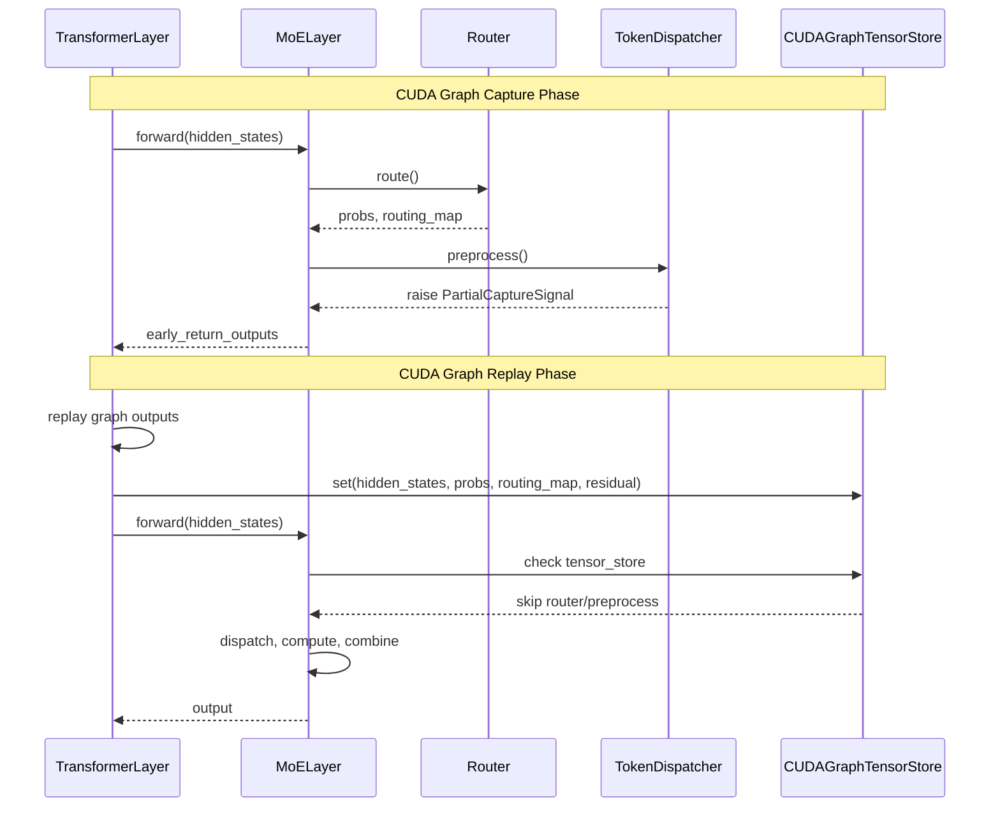

# 为什么近期大模型训练需要用到 CUDA Graph

CUDA Graph 是 NVIDIA 推出的一项技术，它可以将一系列 GPU 操作，包括 kernel launch，memory copy 预先在 capture 阶段录制成一个图，然后在 replay 阶段一次性提交执行。CUDA Graph 最大的好处是可以极大减少 CPU 开销，减少 kernel launch latency，这在使用 Grace CPU 的 B 系列 NV 芯片上带来的好处尤其突出。同时 GPU 可以更好地优化执行顺序，减少运行队列中间的 bubble。
> 针对 B 系列芯片 CPU 开销较大的问题，这里以 MoE 层中 fc1 的 grouped GEMM 操作为例进行说明。以下的实验均在 B 系列芯片上进行。在 Transformer Engine 中，默认的 grouped GEMM 其实是通过循环触发多个 GEMM kernel，并分配到不同的 CUDA stream 上执行（如左图所示），本质上不是“真正”的 grouped GEMM。而如果在 B 系列芯片上直接调用 cutlass，只需启动一次 kernel 即可完成真正的 grouped GEMM（如右图所示），这种方式能显著减少 kernel launch 次数，从而大幅降低 overhead。同时可以看到，左图在 GEMM 计算结束后，队列中出现一段 bubble 才进入激活函数环节，也从侧面反映出 CPU 带来的额外延迟。值得一提的是，TE 默认采用多 stream 实现 grouped GEMM 的做法在 H 系列芯片上通常更优，但迁移到 B 系列时就未必适合了。
> 

当然，使用 CUDA Graph 也引入了一些新的限制和约束：

1. 输入的 Tensor 形状必须保持一致 —— 每次调用时输入 shape 不能变化。
2. 禁止 CPU-GPU 同步操作 —— 在 graph 内部不能包含诸如 `.item()`、`.cpu()` 等涉及同步的指令。
3. 不能存在动态控制流 —— 执行路径必须是确定性的，不能依赖于运行时数据分支。
4. 内存地址需固定 —— 需采用静态分配的输入缓冲区。

其中，“内存地址需固定”这一点对 MoE 模型尤为突出。MoE 的核心机制在于 Token Dispatcher 根据路由器（router）的分配结果，动态决定每个 token 分派给哪个 expert。即每个 batch 的路由都可能不同，进而使 AlltoAll 通信所需的数据大小和内存布局发生变化。而 CUDA Graph 要求 capture 阶段所有操作涉及的 Tensor 地址均已确定，这与 MoE 这种动态分布形成冲突。

为了解决这一问题，工程实践中，我们采用“部分捕获”（Partial Capture）的方案：对于可以静态展现的部分我们用 CUDA Graph 捕获，其余涉及动态路径/动态资源分配的部分则按照传统方式执行。这样既能获得 graph 带来的 kernel launch/调度优化，也能兼顾 MoE 动态收发的灵活性。具体配置如下所示：
```yaml
cuda_graph_impl: transformer_engine
cuda_graph_scope:
  - attn            # 捕获 attention 层
  - moe_router      # 捕获 MoE 路由核心
  - moe_preprocess  # 捕获路由 token 的预处理环节
```
接下来将详细讲解实现原理与核心操作流程。
# TE Capture/Replay 工作流程

## 整体流程

Megatron-LM 支持两种 CUDA Graph 实现方式：其一为 Megatron-LM 自己的实现，通过设置 `cuda_graph_impl:local` 启用。这种方式由 Megatron 原生实现了 graph 的捕获及回放，在 dense 模型场景下，可以一次性录制并复现包含前向与反向传播（不含优化器操作）的完整迭代过程，相关核心代码位于 `megatron/core/transformer/cuda_graphs.py`，主要涉及 `CudaGraphManager` 与 `_CudaGraphRunner`。然而在 MoE 模型情形下，由于需要采用定长 padding，导致无论某个 expert 实际接收到的 token 数量多少，都必须填充到统一的最大容量，这不仅增加了不必要的计算消耗，还带来 AlltoAll 通信带宽的浪费，并且显存也需预留足够的最大 buffer。因此，目前该实现架构并不适合 MoE 场景下的 CUDA Graph 加速需求。

另一种对 CUDA Graph 的支持方式，是通过启用 Transformer Engine（TE）实现的，只需在配置中设置 `cuda_graph_impl:transformer_engine`。我们在 partial CUDA Graph 中使用这套方案。在该方案下，核心流程围绕 TE 的 CUDA Graph 捕获（Capture）与回放（Replay）机制展开。Megatron-LM 集成 TE CUDA Graph 的主要逻辑位于 `megatron/core/transformer/cuda_graphs.py` 的 `TECudaGraphHelper` 类内部，其核心方法是调用 TE 提供的 `make_graphed_callables()` API。从最简单的情况开始考虑，假设只有一个 microbatch，那么整体的工作流程如下：

```python
# 1. 收集待捕获的层
flattened_callables = []
for layer in model.decoder.layers:
    if _layer_is_graphable(layer, config):
        flattened_callables.append(layer)

# 2. 构造示例输入
sample_args, kwargs = self._get_cuda_graph_input_data()
# 形如: ((hidden_states_layer0,), (hidden_states_layer1,), ...)

# 3. 捕获阶段
graphs = make_graphed_callables(
    tuple(flattened_callables),
    sample_args,
    kwargs,
    _order=order,  # 管道并行调度顺序
    _reuse_graph_input_output_buffers=True,  # TE 2.7+ 支持的 buffer 复用特性
)

# 4. 可 CUDA replay的 Graph分配给各层对象
for layer in layers:
    layer.cuda_graphs = [graphs[idx] for idx in ...]
```

**首先是第一阶段，收集待捕获的层**。由于我们是逐层进行捕获，因此首先会依据 config 配置筛选需要捕获 CUDA Graph 的层，依次存入 `flattened_callables`。注意这个时候虽然我们只捕获 MoE layer 的 attn，moe_router 以及 moe_preprocess 这三部分，但是这里我们还是将这个 layer 放进来，后面通过后面说的 Python 的异常机制来实现部分捕获。

**接着是第二阶段，构造示例输入**。在这个阶段需为每一层准备一组示例输入 `sample_args` 与 `kwargs`，这个本质上是在调用 layer 的`get_layer_static_inputs`函数：
```python
args, kwargs = layer.get_layer_static_inputs(self.seq_length, self.micro_batch_size)
```
这套静态输入会作为 前向 graph 的 static input buffer，同时在它上面模拟 前向和反向 跑出来的结果会作为 反向 graph 的 static input buffer。涉及 PP 的调度与 buffer 管理会在后文详细介绍。

**第三阶段是捕获阶段**。在这个阶段我们调用了 TE 的`make_graphed_callables`这个 API。在 `make_graphed_callables` 的内部，核心包括以下环节：

1. Warmup 阶段：多次执行 前向+反向，让类似`triton.compile`这样的操作完成 lazy 初始化，确保后续捕获的稳定性。
2. Capture 阶段：依顺序对每个可调用对象依次执行 前向，再按逆序依次执行 反向。 捕获过程中将所有 CUDA kernel 操作录入 graph，同时固定输入和中间变量的 tensor 地址， 也就是说 前向 期间所有的中间 tensor buffer 其物理地址在 capture 当下即已确定。
```
# All captures here share a mempool. To avoid replays corrupting each other's memory,
# the safest approach is to capture all passes in the same order they'll run:
# fwd 1, fwd 2, ... fwd N, then bwd N, bwd N-1, ... bwd 1.
```
4. `make_graphed_callables` 最终返回一组包装好的 callable，这些**callable 本质上是调用`torch.autograd.Function`的闭包**，调用 callable 的返回值就是有我们自定义 grad_fn 的 tensor。换句话说，我们的 fwd_graph 和 bwd_graph 其实是存在闭包中的。
```python
def make_graphed_callables(...):
    # ... 捕获 graph 的代码 ...
    
    # 这些变量会被闭包捕获
    static_input_surface = [...]
    static_outputs = (...)
    static_grad_outputs = (...)
    static_grad_inputs = (...)
    fwd_graph = torch.cuda.CUDAGraph()
    bwd_graph = torch.cuda.CUDAGraph()
    
    # 定义自定义 autograd function（被闭包捕获）
    class Graphed(torch.autograd.Function):
        @staticmethod
        def forward(ctx, skip_fp8_weight_update, *inputs):
            # 使用闭包捕获的变量
            static_input_surface[i].copy_(inputs[i])
            fwd_graph.replay()
            return tuple(o.detach() for o in static_outputs)
        
        @staticmethod
        def backward(ctx, *grads):
            static_grad_outputs[i].copy_(grads[i])
            bwd_graph.replay()
            return static_grad_inputs
    
    # 闭包函数：捕获 Graphed 和其他变量
    def functionalized(*user_args, **user_kwargs):
        # 调用 Graphed.apply() 执行 forward
        out = Graphed.apply(skip_fp8_weight_update, *func_args)
        return _tree_unflatten(out, output_unflatten_spec)
    
    return functionalized  # 返回闭包
```
**接着是最后阶段**，我们将这些闭包对象分配给各层对象作为一个成员变量，供后续调用。

## CUDA Graph 在 microbatch 之间能否复用？
我们接下来思考另一个问题，现在有多个 microbatches，CUDA Graph 在 microbatch 之间能否复用？不妨假设 number of microbatches=4。实际上，这个和 microbatch 的 前向和反向 调用有关系。
* 第一种情况是，假设每个 microbatch 完成 前向 后立刻进行 反向（也就是 1F1B 调度）。

```
Microbatch:  MB0    MB0    MB1    MB1    MB2    MB2    MB3    MB3
操作:        FWD    BWD    FWD    BWD    FWD    BWD    FWD    BWD
             └──┘   └──┘   └──┘   └──┘   └──┘   └──┘   └──┘   └──┘
              ↑      ↑      ↑      ↑      ↑      ↑      ↑      ↑
             立刻   立刻   立刻   立刻   立刻   立刻   立刻   立刻

order = [1, -1, 1, -1, 1, -1, 1, -1]
         ↑  ↑   ↑  ↑   ↑  ↑   ↑  ↑
       fwd bwd fwd bwd fwd bwd fwd bwd
       mb0 mb0 mb1 mb1 mb2 mb2 mb3 mb3

```

这种情况下显然 CUDA Graph 是可以复用的，同时 input buffer 也是可以复用的。那么这个时候构建的 CUDA Graph 的数量是 2 × num_layers，其中 2 分别为是 前向和反向。
* 另外一种情况是，所有 microbatch 都完成 前向 后，再依次进行 反向。

```
Microbatch:  MB0    MB1    MB2    MB3    MB0    MB1    MB2    MB3
操作:        FWD    FWD    FWD    FWD    BWD    BWD    BWD    BWD
             ←── 所有 Forward ──→     ←── 所有 Backward ──→
             
order = [1, 1, 1, 1, -1, -1, -1, -1]
```

注意到中间变量的地址是存在 CUDA Graph 内部的，如果 microbatch 1 复用 microbatch 0 的 CUDA Graph，那么在 前向 的时候会改掉 microbatch 0 的中间变量，这样在 microbatch 0 在 反向 的时候就没有中间变量就被破坏掉了。这个时候 CUDA Graph 是不可以被复用的，此时 CUDA Graph 的数量是 2 × num_layers × num_microbatches。
很显然，第二个情况需要临时保存的 activation 数量太多了，正常 Megatron-LM 在不开流水线并行的情况下是不可能使用的。时间上我们可以从 Megatron-LM 的实际代码可以看到不开 PP 的时候就是第一种情况的 1F1B 调度：
```python
# megatron/core/pipeline_parallel/schedules.py: forward_backward_no_pipelining

with no_sync_func():  # 前 N-1 个 microbatch 不同步梯度
    for i in range(num_microbatches - 1):
        output_tensor = forward_step(...)   # Forward microbatch i
        if not forward_only:
            backward_step(...)               # Backward microbatch i（立刻！）

# 最后一个 microbatch 在 no_sync 外执行（触发梯度同步）
output_tensor = forward_step(...)           # Forward 最后一个
backward_step(...)                           # Backward 最后一个
```
## 流水线并行下的 TE CUDA Graph 解析

目前，Megatron-LM 采用的流水线并行方案是 1F1B interleaving，如下图所示：


为便于分析，我们先不考虑 VPP，即采用上半图的标准的 1F1B 方案。这里 number_of_microbatches 为 8，PP 为 4。结合前述分析，我们可以得出：microbatch 1 和 microbatch 4 之间的 CUDA Graph 不可以复用，但当 microbatch 1 的 反向 完成后，microbatch 5 在执行前向时，完全可以复用 microbatch 1 对应的 CUDA Graph。在典型 1F1B 调度下，每个 GPU 上同时存在的 activation 峰值仅与 PP 相关，因此在理论上，最优情况下 CUDA Graph 数量下限为 2 × num_layers × PP。

然而，当前实现中 CUDA Graph 的实际数量不是随 PP 增长的，而是随 num_microbatches 线性增长。换言之，不同 microbatch 之间的 CUDA Graph 没有被复用。因此，目前系统中 CUDA Graph 的数量实际为 2 × num_layers × num_microbatches。

我们知道和 num_microbatches 成正比是一个不太好的事情，这意味和 global batch size 成正比，容易出现显存爆炸的问题。为了解决这个问题，我们首先需要明确两个概念： 
1. **CUDA Graph 本身**：即对 CUDA 操作的录制，此部分显存消耗较小，每个 microbatch 都有一份独立的 graph 是没有问题的。
2. **中间变量显存（activation）**：在 CUDA Graph 捕获阶段产生。这部分显存可以在不同的 CUDA Graph 之间共享，经优化后实际占用量与 PP 成正比。这一优化空间及方法我们将在后文详细讨论。

我们回到考虑 VPP 的情况，假设 num_microbatches=8, PP=4，VPP=2。我们首先学习 Megatron-LM 里面是如何表示 1F1B interleaving 的，可以跟着下面代码的思路：
```python
        # Get the PP and VPP scheduling order.
        from megatron.core.pipeline_parallel.schedules import (
            convert_schedule_table_to_order,
            get_pp_rank_microbatches,
            get_schedule_table,
        )

        _, _, num_warmup_microbatches, _ = get_pp_rank_microbatches(
            num_microbatches,
            self.num_model_chunks,
            self.config.microbatch_group_size_per_vp_stage,
            False,
        )
        schedule_table = get_schedule_table(
            num_microbatches,
            self.num_model_chunks,
            self.config.microbatch_group_size_per_vp_stage,
        )
        order = convert_schedule_table_to_order(
            num_warmup_microbatches, self.num_model_chunks, schedule_table
        )
```

首先，假设整个模型有 32 层（Layer 0-31），那么我们就将整个模型切分成 PP × VPP 个 model chunk，每个 PP rank 就有 VPP 个 model chunk：
```
模型: Layer 0-31 (32层)
PP = 4, VPP = 2 (num_model_chunks = 2)

PP Rank 0: [Layer 0-3]   ← Chunk 0
           [Layer 16-19] ← Chunk 1

PP Rank 1: [Layer 4-7]   ← Chunk 0
           [Layer 20-23] ← Chunk 1

PP Rank 2: [Layer 8-11]  ← Chunk 0
           [Layer 24-27] ← Chunk 1

PP Rank 3: [Layer 12-15] ← Chunk 0
           [Layer 28-31] ← Chunk 1
```
对于一个 PP rank 来说，其实它只能看到本地的 VPP=2 个 model chunk，因此它其实依次这样的操作：选择本地的某一个 model chunk 进行 fwd 或者 bwd。在 Megatron-LM 里面，我们用一个数字来表示这样的操作，"绝对值-1"表示本地的哪一个 model chunk，正负号表示 fwd 还是 bwd。
比如对于上面的 PP Rank 0:
* 1 表示[Layer 0-3] (chunk 0)做 fwd；
* 2 表示[Layer 16-19] (chunk 1) 做 fwd;
* -1 表示[Layer 0-3] (chunk 0) 做 bwd；
* -2 表示[Layer 16-19] (chunk 1) 做 bwd;
每个 PP rank 都能拿到一个叫 order 的序列，只要编排好，每个 PP rank 按照本地编排的 order 依次执行，那么整体上就能形成一个完整的流水线：比如上图的 Device 1 的 order 就是
```python
order = [
    # Warmup (10 forwards)
    1, 1, 1, 1,      # chunk 0 fwd: mb 1,2,3,4
    2, 2, 2, 2,      # chunk 1 fwd: mb 1,2,3,4
    1, 1,            # chunk 0 fwd: mb 5,6
    
    # 1F1B steady state (交替 fwd/bwd)
    1, -1,           # F_mb7_c0, B_mb1_c1
    1, -1,           # F_mb8_c0, B_mb2_c1
    2, -2,           # F_mb5_c1, B_mb1_c0
    2, -2,           # F_mb6_c1, B_mb2_c0
    2, -1,           # F_mb7_c1, B_mb3_c1
    2, -1,           # F_mb8_c1, B_mb4_c1
    
    # Cooldown (全 backward)
    -2, -2,          # B_mb5,6_c0
    -1, -1,          # B_mb5,6_c1
    -2, -2,          # B_mb3,4_c0
    -1, -1,          # B_mb7,8_c1
    -2, -2,          # B_mb7,8_c0
]
```
其中我们可以看到分为三个阶段：warmup 阶段（全是 前向），1F1B 交替阶段，以及 cooldown 阶段（全是 反向）。那么对于每个 PP rank 怎么才能得到这个数组呢？我们跟着上面的代码来就行：
* 首先`get_pp_rank_microbatches` 告诉我们 num_warmup_microbatches 的计算公式就是

$$
(PP - rank - 1) * 2 + (VPP - 1) * \text{microbatch_group_size_per_vp_stage}
$$

这里 microbatch_group_size_pervp_stage 表示每个 virtual stage 连续执行的 microbatch 数量，默认值是 PP。代入到上图里计算确实这样。
接着是`get_schedule_table`这个函数，这个函数是个生成 (microbatch_id, model_chunk_id) 的调度顺序，实际上是每个 PP rank 上 fwd 操作的顺序，这个数组每个 PP rank 看到的都是一样的，从上图中看到的确实是这样。同时这个顺序顺序也是每个 PP rank 上看到 反向 操作的顺序。
```python
def get_schedule_table(num_microbatches, num_model_chunks, microbatch_group_size_per_vp_stage):
    """
    生成 (microbatch_id, model_chunk_id) 的调度顺序
    """
    schedule_table = []
    
    # 按 group 遍历所有 microbatch
    for min_microbatch_id_in_group in range(0, num_microbatches, microbatch_group_size_per_vp_stage):
        
        # 对于每个 group：
        # 外层循环: model_chunk_id (0, 1, ..., VPP-1)
        # 内层循环: microbatch_id (group 内的连续 microbatch)
        
        schedule_table.extend([
            (microbatch_id, model_chunk_id)
            for model_chunk_id in range(num_model_chunks)      # 外层
            for microbatch_id in range(group_start, group_end)  # 内层
        ])
    
    return schedule_table
```
比如参数为 num_microbatches=8, num_model_chunks=2, microbatch_group_size=4 的时候，
```
# Group 0: microbatch 0-3
# Group 1: microbatch 4-7

# 遍历过程：
Group 0 (mb 0-3):
  chunk 0: mb 0, 1, 2, 3  →  (0,0), (1,0), (2,0), (3,0)
  chunk 1: mb 0, 1, 2, 3  →  (0,1), (1,1), (2,1), (3,1)

Group 1 (mb 4-7):
  chunk 0: mb 4, 5, 6, 7  →  (4,0), (5,0), (6,0), (7,0)
  chunk 1: mb 4, 5, 6, 7  →  (4,1), (5,1), (6,1), (7,1)

# 最终 schedule_table:
schedule_table = [
    (0,0), (1,0), (2,0), (3,0),  # chunk 0, mb 0-3
    (0,1), (1,1), (2,1), (3,1),  # chunk 1, mb 0-3
    (4,0), (5,0), (6,0), (7,0),  # chunk 0, mb 4-7
    (4,1), (5,1), (6,1), (7,1),  # chunk 1, mb 4-7
]
```

接着是`convert_schedule_table_to_order`这个函数，每个 PP rank 的 num_warmup_microbatches 是不一样的，都是都是全 前向（warmup） + 前向和反向 交替 + 全 反向 三个阶段。只需要知道 warmup 有几个 microbatches，后面的就能模拟出来了。
```python

# Step 1: schedule_table
schedule_table = [
    (0,0), (1,0), (2,0), (3,0),  # chunk 0, mb 0-3
    (0,1), (1,1), (2,1), (3,1),  # chunk 1, mb 0-3
    (4,0), (5,0), (6,0), (7,0),  # chunk 0, mb 4-7
    (4,1), (5,1), (6,1), (7,1),  # chunk 1, mb 4-7
]

# _, model_chunk_id_table = zip(*schedule_table)
model_chunk_id_table = [0,0,0,0, 1,1,1,1, 0,0,0,0, 1,1,1,1]

# Step 2: forward_order 和 backward_order
forward_order  = [1,1,1,1, 2,2,2,2, 1,1,1,1, 2,2,2,2]   # chunk_id + 1
backward_order = [-2,-2,-2,-2, -1,-1,-1,-1, -2,-2,-2,-2, -1,-1,-1,-1]  # chunk_id - 2

# Step 3: 生成 order
# Warmup: forward_order[:10]
order = [1,1,1,1, 2,2,2,2, 1,1]

# 1F1B: i = 10 to 15
# i=10: fwd[10]=1, bwd[0]=-2  → [1, -2]
# i=11: fwd[11]=1, bwd[1]=-2  → [1, -2]
# i=12: fwd[12]=2, bwd[2]=-2  → [2, -2]
# i=13: fwd[13]=2, bwd[3]=-2  → [2, -2]
# i=14: fwd[14]=2, bwd[4]=-1  → [2, -1]
# i=15: fwd[15]=2, bwd[5]=-1  → [2, -1]

# Cooldown: backward_order[-10:]
# = [-1,-1, -2,-2,-2,-2, -1,-1,-1,-1]

```

> 补充一句，VPP 的本质是切更多的流水线阶段，只是将部分流水线阶段划分到同一个 GPU 上。如果我们的 GPU 数量足够，其实完全可以把这些被切分出来的子阶段分别放在不同的 GPU 上，只是受限于现实资源有限，只能将多个阶段合并放置于同一块 GPU 罢了。因此从理论分析的角度，Bubble time fraction 就是会下降至原先的 1/VPP，因为本质上流水线阶段就是变多了。

有了这个 order 之后，一个非常简单规则：当 order 中出现一个负数（反向），对应的 前向 buffer 就可以被后续的 前向 复用了。这个规则将指导我们下面的显存复用，做到和 PP 成正比。

> 更加准确地说，同时因为进入稳定 1F1B 阶段正数和负数是交替的，是边使用边释放，因此更加准确来说，activation 的峰值占用和(PP - rank - 1) × 2 + (VPP - 1) × PP + 1 成正比。

## fwd graph 的 Static Input buffer 的大小如何做到和 PP 成正比？

根据这个简单规则简单模拟即可。注意一个 model chunk 对应多个 layer，我们首先获得每个 layer 的输入应该长什么样子（记为 sample_keys), 然后模拟即可：
```python
# Forward: 尝试复用
if consumed_sample_queue.get(sample_keys, []):
    # 有可复用的 → 直接复用
    reuse_fwd_idx = consumed_sample_queue[sample_keys].pop(0)
    sample_args[per_callable_fwd_idx] = sample_args[reuse_fwd_idx]  # 复用！
else:
    # 没有可复用的 → 生成新的
    sample_args[per_callable_fwd_idx] = _get_layer_static_inputs(...)

# Backward: 释放 buffer
for sample_keys, fwd_idx in fwd_sample_queues[chunk][:num_layers]:
    consumed_sample_queue[sample_keys].append(fwd_idx)  # 标记可复用
```
这部分其实是 TE 的 make_graphed_callables()的参数`_reuse_graph_input_output_buffers`对 fwd graph 的 input buffer 做的[事情](https://github.com/NVIDIA/TransformerEngine/blob/74faf7ec422229bcecf9e079d96b429da071e7b7/transformer_engine/pytorch/graph.py#L241-L292)。对于 bwd graph 的 input buffer，这部分不需要像 fwd 那样保存中间结构，[直接检查 key 是否存在然后复用即可](https://github.com/NVIDIA/TransformerEngine/blame/74faf7ec422229bcecf9e079d96b429da071e7b7/transformer_engine/pytorch/graph.py#L615C18-L628)。这样就可以做到 static Input buffer 的大小和 PP 成正比。当然在 Megatron-LM 中准备 sample args 的时候，也要[参考 TE 这样做](https://github.com/NVIDIA/Megatron-LM/blob/708069774569517cc1802e6c339730a689179d4d/megatron/core/transformer/cuda_graphs.py#L1928-L2031)，不然在运行某个时候这部分大小会和 num_microbatches 成正比。

## 中间变量的显存占用如何做到和 PP 成正比？

Static Input buffer 这部分我们可以自己通过模拟 pipeline 的调度显式控制，使得和 PP 而不是和 num_microbatches 成正比。
另外一个需要思考的如何让中间变量的显存占用做到和 PP 成正比。为了实现这个我们需要的使用到 memory pool 这个功能以及 pytorch 的`make_weak_ref`这个功能。
首先，我们需要让所有的 graph 都共享一个 memory pool，
```python
# graph.py:359
mempool = graph_pool_handle() if pool is None else pool

# 所有 graph 捕获时都使用同一个 pool
with _graph_context_wrapper(fwd_graph, pool=mempool):  # forward graph
    outputs = func(*args, **kwargs)

with _graph_context_wrapper(bwd_graph, pool=mempool):  # backward graph
    ...
```
因为 PyTorch 的 API 默认情况下，每个 CUDA Graph 有私有内存池，内存不能互相复用；所有 Graph 共享一个池才有复用的可能性。
```
┌─────────────────────────────────────────────────────────────┐
│  默认行为：每个 CUDA Graph 有私有内存池                      │
│  ┌─────────┐  ┌─────────┐  ┌─────────┐                     │
│  │ Graph 1 │  │ Graph 2 │  │ Graph 3 │  ...                │
│  │ Pool 1  │  │ Pool 2  │  │ Pool 3  │                     │
│  └─────────┘  └─────────┘  └─────────┘                     │
│  内存不能互相复用 → 总显存 = N * graph_size                 │
├─────────────────────────────────────────────────────────────┤
│  共享 Memory Pool：所有 Graph 共享一个池                    │
│  ┌─────────────────────────────────────────────────────┐   │
│  │              Shared Memory Pool                      │   │
│  │  ┌───────┐ ┌───────┐ ┌───────┐                      │   │
│  │  │Graph 1│ │Graph 2│ │Graph 3│  ...                 │   │
│  │  └───────┘ └───────┘ └───────┘                      │   │
│  │  内存可以复用 → 总显存 = max_concurrent * graph_size │   │
│  └─────────────────────────────────────────────────────┘   │
└─────────────────────────────────────────────────────────────┘
```
在复用了同一个 memory pool 之后，为了让中间变量释放，我们需要做的是及时触发 python 的 gc 自动删除不再需要的中间变量。在这里，我们需要用到 Pytorch 的`make_weak_ref`这个功能：
```python
class _WeakRefTensor:
    """只保存 data_ptr，不持有 tensor 引用"""
    def __init__(self, data_ptr, dtype, shape):
        self._data_ptr = data_ptr   # 只记录地址
        self.dtype = dtype
        self.shape = shape
        # 注意：没有保存对原 tensor 的引用！

def make_weak_ref(x):
    if isinstance(x, torch.Tensor):
        return _WeakRefTensor(x.data_ptr(), x.dtype, x.shape)
        # 原 tensor 的引用被丢弃 → PyTorch 认为该内存可以释放
```
其核心原理是：make_weak_ref 把"持有引用的 tensor 对象"替换成"只记录地址的整数"，原 tensor 失去所有引用后被 Python GC 回收，PyTorch 随之释放其 GPU 内存回 mempool。地址虽然还被记住，但内存已经可以被其他 graph 复用了。
```
原始状态：
┌─────────────────────────────────────────────┐
│  per_callable_static_outputs[idx]           │
│  = (tensor_A, tensor_B, tensor_C)           │
│        ↓         ↓         ↓                │
│   ┌────────┐ ┌────────┐ ┌────────┐          │
│   │ Memory │ │ Memory │ │ Memory │ (被占用) │
│   └────────┘ └────────┘ └────────┘          │
└─────────────────────────────────────────────┘

调用 make_weak_ref 后：
┌─────────────────────────────────────────────┐
│  per_callable_static_outputs[idx]           │
│  = (_WeakRefTensor, _WeakRefTensor, ...)    │
│        ↓ (只保存地址，不持有引用)            │
│   ┌────────┐ ┌────────┐ ┌────────┐          │
│   │ Memory │ │ Memory │ │ Memory │ (可复用) │
│   └────────┘ └────────┘ └────────┘          │
│   ↑ PyTorch 认为这些内存不再被使用          │
│   ↑ 可以被后续的 graph capture 复用         │
└─────────────────────────────────────────────┘
```
因此，当完成一个 反向 后，我们能将三部分 tensor 设置为 weak reference，从而触发 Python 的自动 GC：
```python
# graph.py:634-665
# Weak ref the static outputs and static grad inputs that are no longer needed
# in the following steps. These two type of tensors are both in cudagraph
# mempool, so we just deallocate them and let PyTorch's memory allocator
# reuse them elsewhere.
if _reuse_graph_input_output_buffers:
    # 1. Weak ref the static outputs of the forward pass of this backward. It's
    # no longer needed after the corresponding backward graph is built up.
    per_callable_static_outputs[per_callable_bwd_idx] = make_weak_ref(
        static_outputs
    )

    # 2. Weak ref the static grad inputs of the previous backward pass within the
    # same chunk.
    if previous_per_callable_bwd_idx is not None:
        idx = previous_per_callable_bwd_idx
        per_callable_static_grad_inputs[idx] = make_weak_ref(
            per_callable_static_grad_inputs[idx]
        )
    previous_per_callable_bwd_idx = per_callable_bwd_idx

    # 3. Weak ref the static grad inputs of the previous chunk's last backward
    # pass.
    # Note: After a chunk's backward pass, we assume Mcore will send the grad
    # input to another pipeline parallel rank and that the communication is
    # finished before the end of the next chunk's backward pass.
    if l_no == 0:
        if previous_chunk_last_callable_bwd_idx is not None:
            idx = previous_chunk_last_callable_bwd_idx
            per_callable_static_grad_inputs[idx] = make_weak_ref(
                per_callable_static_grad_inputs[idx]
            )
        previous_chunk_last_callable_bwd_idx = per_callable_bwd_idx
                if ceil(c_id) == c_id:
                    bwd_idx[m_chunk] += 1
```


# MoE Partial Capture/Replay 的工作流程

上面的叙述适用于任意 layer，对于 dense layer 这种可以完全被 capture 没有太大的问题，对于 MoE layer，我们需要根据 config 配置 capture 部分操作。为了实现这部分功能，我们基于基于 Python 异常机制实现 graph 边界的动态中断与恢复。首先我们看 MoE partial capture/replay 的总体工作流程如下：


```mermaid
sequenceDiagram
    participant TL as TransformerLayer
    participant MoE as MoELayer
    participant Router as Router
    participant Dispatcher as TokenDispatcher
    participant Store as CUDAGraphTensorStore

    Note over TL,Store: CUDA Graph Capture Phase
    TL->>MoE: forward(hidden_states)
    MoE->>Router: route()
    Router-->>MoE: probs, routing_map
    MoE->>Dispatcher: preprocess()
    Dispatcher-->>MoE: raise PartialCaptureSignal
    MoE-->>TL: early_return_outputs

    Note over TL,Store: CUDA Graph Replay Phase
    TL->>TL: replay graph outputs
    TL->>Store: set(hidden_states, probs, routing_map, residual)
    TL->>MoE: forward(hidden_states)
    MoE->>Store: check tensor_store
    Store-->>MoE: skip router/preprocess
    MoE->>MoE: dispatch, compute, combine
    MoE-->>TL: output
```


我们分为 capture 阶段和 replay 阶段来看如何实现 Partial CUDA Graph 技术：
* **异常信号机制**：在 capture 阶段使用 `MoECudaGraphPartialCaptureSignal` 实现优雅的提前返回，只捕获静态部分（attention、router、preprocess）
* **状态恢复机制**：在 replay 阶段，使用 `MoECudaGraphTensorStore` 跳过已计算部分

## 实现 MoE 的 Partial Capture：装饰器+异常

我们首先自顶向下来看 CUDA Graph Capture 的过程。
首先是最外层的`TransformerLayer`, TransformerLayer 原本继承自`MegatronModule`, 现在改成继承自`GraphableMegatronModule`。`GraphableMegatronModule` 是支持 CUDA Graph 的 Megatron 模块基类，目前被 TransformerLayer 和 MambaLayer 继承。
在初始化中，我们存储记录每个 microbatch 的 graph callable（就是上文描述过的闭包）以及手动 hook（后面会描述）：
```python
def __init__(self, config: TransformerConfig, vp_stage: Optional[int] = None):
    super().__init__(config)
    
    if config.cuda_graph_impl == "local":
        # Local 实现：使用 CudaGraphManager
        self.cudagraph_manager = CudaGraphManager(config, vp_stage=vp_stage)
        
    elif config.cuda_graph_impl == "transformer_engine":
        # TE 实现：
        self.cuda_graphs = []          # 存储每个 microbatch 的 graph callable
        self.cuda_graph_manual_hooks = []  # 手动 hooks（参数 all-gather 等）
```
其 __call__ 函数就会检查是否走 TE CUDA Graph 路径：
```python
# module.py:285-300
def __call__(self, *args, **kwargs):
    if self._should_call_local_cudagraph(*args, **kwargs):
        # Local 实现
        return self.cudagraph_manager(self, args, kwargs)
    elif self._should_call_te_cudagraph(*args, **kwargs):
        if not self.cuda_graphs:
            # Capture 模式
            cuda_graph_func = self._te_cuda_graph_capture
        else:
            # Replay 模式
            cuda_graph_func = self._te_cuda_graph_replay
        return cuda_graph_func(*args, **kwargs)
    # 普通 forward
    return super().__call__(*args, **kwargs)
```

其中，继承`GraphableMegatronModule`需要自定义`_te_cuda_graph_capture`分别制定 TE CUDA Graph Capture 和 TE CUDA Graph replay 的时候要怎么做。`TransformerLayer`的`_te_cuda_graph_capture`实现如下：
```python
def _te_cuda_graph_capture(self, *args, **kwargs):
    # 根据 scope 决定捕获什么
    if not self.config.cuda_graph_scope or 'attn' in self.config.cuda_graph_scope:
        hidden_states, context = self._forward_attention(*args, **kwargs)
    
    if 'moe_router' in self.config.cuda_graph_scope:
        hidden_states = self._forward_mlp(hidden_states)  # 会触发异常提前返回
    
    # 收集输出
    cuda_graph_outputs = [hidden_states, ...]
    return tuple(cuda_graph_outputs)
```
这里我们就能很清晰看到如何根据配置选择需要执行的范围。如果我们只 capture attn 部分，那么我们就不会运行`_前向_mlp`部分，这个时候__call__的调用就没有跑完整个 transformer layer 了，直接就返回了 attn 的结果。但是如果我们想 capture `_前向_mlp` 的前半部分，本质上这里是可以类似 attn 一样继续拆分下去的，只要在合适的点退出即可。事实上，我们确实对 MoE 的 前向 被拆分成多个独立的函数：
```python
class MoELayer(BaseMoELayer):
    def __init__(self, ...):
        # ... 省略其他初始化 ...
    
    @maybe_skip_or_early_return_by_cudagraph("shared_experts_compute")
    def shared_experts_compute(self, hidden_states: torch.Tensor):
        """计算 shared expert 的输出（如果配置了的话）"""
        shared_expert_output = None
        if self.use_shared_expert and not self.shared_expert_overlap:
            if self.shared_experts_recompute:
                shared_expert_output = tensor_parallel.checkpoint(
                    self.shared_experts, False, hidden_states
                )
            else:
                shared_expert_output = self.shared_experts(hidden_states)
        return shared_expert_output
    
    @maybe_skip_or_early_return_by_cudagraph("route")
    def route(self, hidden_states: torch.Tensor):
        """使用 router 计算 token 到 expert 的映射"""
        probs, routing_map = self.router(hidden_states)
        return probs, routing_map
    
    @maybe_skip_or_early_return_by_cudagraph("preprocess")
    def preprocess(self, hidden_states, probs, routing_map):
        """预处理：计算通信 splits，重排 token"""
        residual = hidden_states
        hidden_states, probs = self.token_dispatcher.dispatch_preprocess(
            hidden_states, routing_map, probs
        )
        return hidden_states, probs, residual
    
    # 以下方法不使用装饰器，因为它们已经在 partial capture 范围之外
    def dispatch(self, hidden_states, probs):
        """执行 AlltoAll 通信"""
        return self.token_dispatcher.token_dispatch(hidden_states, probs)
    
    def routed_experts_compute(self, hidden_states, probs, residual):
        """在 dispatched tokens 上计算 expert 输出"""
        dispatched_input, tokens_per_expert, permuted_probs = (
            self.token_dispatcher.dispatch_postprocess(hidden_states, probs)
        )
        expert_output, mlp_bias = self.experts(dispatched_input, tokens_per_expert)
        output = self.token_dispatcher.combine_preprocess(expert_output)
        return output, mlp_bias
    
    def combine(self, output, shared_expert_output):
        """合并 routed expert 和 shared expert 的输出"""
        output = self.token_dispatcher.token_combine(output)
        if shared_expert_output is not None:
            output = output + shared_expert_output
        return output
```
理论上我们可以类似刚才`TransformerLayer`的`_te_cuda_graph_capture`函数，读取 config 判断什么时候退出即可，但是这样对代码侵入改动太大了。面对这样的问题，其实就是在某函数上“外包”一层，直接使用装饰器模式：
```python
def maybe_skip_or_early_return_by_cudagraph(step_condition):
    """
    step_condition 可以是:
    - "shared_experts_compute": 跳过 shared expert 计算
    - "route": 跳过 router 计算（或在 capture 时提前返回）
    - "preprocess": 跳过 preprocess 计算（或在 capture 时提前返回）
    """
    
    def maybe_raise_signal(moe_layer, **kwargs):
        """Capture 阶段：检查是否需要提前返回"""
        if (
            moe_layer.config.cuda_graph_impl == "transformer_engine"
            and moe_layer.training
            and is_graph_capturing()
        ):
            if step_condition == "route" and 'moe_router' in scope and 'moe_preprocess' not in scope:
                raise MoECudaGraphPartialCaptureSignal(moe_layer, "route", **kwargs)
            elif step_condition == "preprocess" and 'moe_preprocess' in scope:
                raise MoECudaGraphPartialCaptureSignal(moe_layer, "preprocess", **kwargs)
    
    def decorator(func):
        def wrapped_func(moe_layer, *args, **kwargs):
            # 非 cudagraph 路径：直接执行
            if not is_graph_capturing() and moe_layer.cudagraph_tensor_store.is_empty():
                return func(moe_layer, *args, **kwargs)
            
            # Capture 和 Replay 路径
            if step_condition == "route":
                if moe_layer.cudagraph_tensor_store.probs is None:
		            # Capture 阶段
                    # 执行 router 计算
                    probs, routing_map = func(moe_layer, *args, **kwargs)
                    # 可能抛出异常提前返回
                    maybe_raise_signal(moe_layer, probs=probs, routing_map=routing_map)
                else:
                    # Replay 阶段：从 store 读取，跳过计算
                    probs = moe_layer.cudagraph_tensor_store.probs
                    routing_map = moe_layer.cudagraph_tensor_store.routing_map
                return probs, routing_map
            
            # 类似处理 "preprocess" 和 "shared_experts_compute"
        return wrapped_func
    return decorator
```
注意这个装饰器其在 Capture 和 Replay 都有用到，用`is_graph_capturing()`来区分 Capture vs Replay。我们可以先关注 Capture 部分，我们发现，这里就是根据 config 来判断什么时候抛出异常，同时这个异常还会带有信息来帮助我们得到中间结果。下面是`MoECudaGraphPartialCaptureSignal`这个异常的定义：

```python
# megatron/core/transformer/moe/moe_utils.py

class MoECudaGraphPartialCaptureSignal(Exception):
    """
    用于在 CUDA Graph capture 阶段从 MoE 层提前返回。
    当我们只想部分捕获 MoE 层时，会抛出这个异常。
    """
    
    def __init__(self, moe_layer, return_step: str, **kwargs):
        self.moe_layer = moe_layer
        self.return_step = return_step  # "route" 或 "preprocess"
        self.kwargs = kwargs  # 保存中间结果
    
    def get_early_return_outputs(self, hidden_states, shared_expert_output):
        """收集作为 CUDA Graph 输出的张量"""
        
        if self.return_step == "route":
            # moe_router scope: 返回 3 个张量
            outputs = [hidden_states, self.kwargs['probs'], self.kwargs['routing_map']]
            
        elif self.return_step == "preprocess":
            # moe_preprocess scope: 返回 3 个张量 + dispatcher 属性
            outputs = [self.kwargs['hidden_states'], self.kwargs['probs'], self.kwargs['residual']]
            
            # 遍历 dispatcher 的 cudagraph_attrs，收集所有 tensor 属性
            for attr_name in self.moe_layer.token_dispatcher.cudagraph_attrs:
                # 支持层级属性，如 'shared_experts.gate_score'
                hier_attr_name = attr_name.split('.')
                attr = self.moe_layer.token_dispatcher
                for name in hier_attr_name:
                    attr = getattr(attr, name, None)
                    if attr is None:
                        break
                if isinstance(attr, torch.Tensor):
                    outputs.append(attr)
        
        # 如果有 shared expert output，也加入
        if shared_expert_output is not None:
            outputs.append(shared_expert_output)
        
        return outputs
```

因此对于 MoE 层， 我们只需要在 前向 里面捕捉一下异常即可：

```python
def forward(self, hidden_states: torch.Tensor):
    """MoE forward: route → dispatch → compute → combine"""
    
    # ECHO 模式使用不同的 forward
    if self.config.moe_enable_echo:
        return self.echo_forward(hidden_states)
    
    def custom_forward(hidden_states):
        try:
            # 这三个方法都被装饰器包装
            # Capture 阶段：可能在任意位置抛出异常
            # Replay 阶段：检查 tensor_store，可能跳过计算
            shared_expert_output = self.shared_experts_compute(hidden_states)
            probs, routing_map = self.route(hidden_states)
            hidden_states, probs, residual = self.preprocess(hidden_states, probs, routing_map)
            
        except MoECudaGraphPartialCaptureSignal as e:
            # 捕获 Partial Capture 信号
            # 这意味着我们只需要返回中间结果作为 CUDA Graph 输出
            return e.get_early_return_outputs(hidden_states, shared_expert_output)
        
        # 如果没有抛出异常，继续执行剩余部分
        # 这部分在 Capture 阶段不会执行（因为异常提前返回）
        # 在 Replay 阶段会执行（从 store 恢复后继续）
        dispatched_input, probs = self.dispatch(hidden_states, probs)
        output, mlp_bias = self.routed_experts_compute(dispatched_input, probs, residual)
        output = self.combine(output, shared_expert_output)
        return output, mlp_bias
    
    # 支持激活重计算
    if self.moe_layer_recompute:
        outputs = tensor_parallel.checkpoint(custom_forward, False, hidden_states)
    else:
        outputs = custom_forward(hidden_states)
    
    return outputs
```

另外需要注意一点是，Preprocess 会被 Graph Capture，但是其计算结果 tokens_per_expert, routing_map 等这些被存储为 dispatcher 的属性，因此这些也需要作为 CUDA Graph 的输出，我们用`cudagraph_attrs`来标记。
```python
# dispatcher.preprocess() 执行后会设置这些属性：
dispatcher.tokens_per_expert = [100, 50, 200, ...] # 动态计算的！
dispatcher.routing_map = torch.Tensor(...)
dispatcher.input_splits = [...]
# ... 等等
```

同时我们需要调整 DtoH 同步点，需要延迟到 `before_ep_alltoall`完成 DtoH 的同步。
```python
class MoEAlltoAllTokenDispatcher(MoETokenDispatcher):
    def __init__(self, ...):
        # ... 省略其他初始化 ...
        
        # 调整 DtoH 同步点：如果使用 moe_preprocess，延迟到 graph 边界之后
        if (
            config.cuda_graph_impl == "transformer_engine"
            and 'moe_preprocess' in config.cuda_graph_scope
        ):
            self.cuda_dtoh_point = "before_ep_alltoall"  # 延迟
        else:
            self.cuda_dtoh_point = "before_permutation_1"  # 默认
        
        # 需要被 CUDA Graph 捕获的属性列表
        self.cudagraph_attrs = [
            'tokens_per_expert',                        # 每个 expert 的 token 数量
            'input_splits',                             # 发送到各 EP rank 的 token 数
            'output_splits',                            # 从各 EP rank 接收的 token 数
            'output_splits_tp',                         # 从各 TP rank 接收的 token 数
            'num_out_tokens',                           # 输出 token 总数
            'num_global_tokens_per_local_expert',       # 全局 token 分布
            'reversed_local_input_permutation_mapping', # 反向 permutation 映射
            'routing_map',                              # token-expert 路由映射
        ]
        self.valid_cudagraph_attrs = None  # 实际有效的属性（Capture 时确定）
    
    def set_shared_experts(self, shared_experts):
        """设置 shared expert 时，添加额外的属性"""
        super().set_shared_experts(shared_experts)
        if shared_experts.use_shared_expert_gate:
            self.cudagraph_attrs.append('shared_experts.gate_score')
        self.cudagraph_attrs.append('shared_experts.cached_fc1_input')
```
另外一个区别是是 cudagraph_attrs 和 valid_cudagraph_attrs。cudagraph_attrs 是静态定义的"想要捕获的属性"候选列表，valid_cudagraph_attrs 是运行时验证后"实际存在且是 tensor"的有效列表。这种设计允许不同配置（如是否使用 shared expert gate）复用同一份代码，同时确保 graph 输出结构的一致性。
```
cudagraph_attrs (候选，静态定义):
┌─────────────────────────────────────────────────────┐
│ tokens_per_expert                                   │
│ input_splits                                        │
│ output_splits                                       │
│ routing_map                                         │
│ shared_experts.gate_score      ← 可能不存在        │
│ shared_experts.cached_fc1_input ← 可能不存在       │
└─────────────────────────────────────────────────────┘
                    │
                    ↓ 运行时过滤
                    
valid_cudagraph_attrs (有效，运行时确定):
┌─────────────────────────────────────────────────────┐
│ tokens_per_expert              ✓ 存在且是 tensor   │
│ input_splits                   ✓ 存在且是 tensor   │
│ output_splits                  ✓ 存在且是 tensor   │
│ routing_map                    ✓ 存在且是 tensor   │
│ (shared_experts.gate_score 被过滤掉 - 不存在)       │
│ (shared_experts.cached_fc1_input 被过滤掉)         │
└─────────────────────────────────────────────────────┘
```


## 实现 MoE 的 Partial Replay：装饰器+状态恢复

至此，我们已经完全理解了 CUDA Graph Capture 的流程，做完这套流程后，TransformerLayer 下的 cuda_graphs 属性已经设置好了每个 microbatch 的 graph callable 闭包了，我们看一下 Replay 情况下，TransformerLayer 的`_te_cuda_graph_replay`在做什么事情：
```python
def _te_cuda_graph_replay(self, *args, **kwargs):
    # 1. 调用父类 replay
    cuda_graph_output = super()._te_cuda_graph_replay(*args, **kwargs)
    
    if 'moe_router' in scope:
        # 2. 解析输出
        hidden_states, probs, routing_map_or_residual = cuda_graph_output[:3]
        
        # 3. 恢复 dispatcher 属性
        for i, attr_name in enumerate(valid_cudagraph_attrs):
            setattr(dispatcher, attr_name, cuda_graph_output[3+i])
        
        # 4. 设置 tensor store
        self.mlp.cudagraph_tensor_store.set(
            hidden_states=hidden_states,
            probs=probs,
            residual=residual,
        )
        
        # 5. 继续 MoE forward
        mlp_output = self.mlp(hidden_states)
        
        # 6. 清理 store
        self.mlp.cudagraph_tensor_store.clear()
```
其中父类`GraphableMegatronModule`就是在根据当前的 microbatch index 来设置 hook（后面会讲到）和调用闭包。
```python
    def _te_cuda_graph_replay(self, *args, **kwargs):
        """
        CUDA Graph replay for this layer and microbatch `self.current_microbatch` using TE
        interface. TransformerEngine versions>=1.10 allow keyword arguments with CUDA Graph.
        However, CUDA Graph accepts only Tensor inputs.
        Hence, check if the arguments are all tensors.
        """
		# ...
        cg_index = getattr(self, 'current_microbatch', 0) % len(self.cuda_graphs)
        cudagraph_args, cudagraph_kwargs = self._get_te_cuda_graph_replay_args(*args, **kwargs)

        for hook, hook_args in self.cuda_graph_manual_hooks:
            hook(*hook_args)
        return self.cuda_graphs[cg_index](*cudagraph_args, **cudagraph_kwargs)
```
我们可以看到 TransformerLayer 的会将闭包的结果保存到一个特殊的类 MoECudaGraphTensorStore 来统一保存 CUDA Graph 的结果，接着会调用原先应该执行的 mlp 函数，接下来的问题是，mlp 函数的部分计算已经在 CUDA Graph 里面算过了，怎么跳过这些部分呢？

答案还是通过装饰器的方式。只不过现在不是抛出异常而是直接从 MoECudaGraphTensorStore 读取即可：
```python
def maybe_skip_or_early_return_by_cudagraph(step_condition):
    """
    step_condition 可以是:
    - "shared_experts_compute": 跳过 shared expert 计算
    - "route": 跳过 router 计算（或在 capture 时提前返回）
    - "preprocess": 跳过 preprocess 计算（或在 capture 时提前返回）
    """
    
    def maybe_raise_signal(moe_layer, **kwargs):
        """Capture 阶段：检查是否需要提前返回"""
        if (
            moe_layer.config.cuda_graph_impl == "transformer_engine"
            and moe_layer.training
            and is_graph_capturing()
        ):
            if step_condition == "route" and 'moe_router' in scope and 'moe_preprocess' not in scope:
                raise MoECudaGraphPartialCaptureSignal(moe_layer, "route", **kwargs)
            elif step_condition == "preprocess" and 'moe_preprocess' in scope:
                raise MoECudaGraphPartialCaptureSignal(moe_layer, "preprocess", **kwargs)
    
    def decorator(func):
        def wrapped_func(moe_layer, *args, **kwargs):
            # 非 cudagraph 路径：直接执行
            if not is_graph_capturing() and moe_layer.cudagraph_tensor_store.is_empty():
                return func(moe_layer, *args, **kwargs)
            
            # Capture 和 Replay 路径
            if step_condition == "route":
                if moe_layer.cudagraph_tensor_store.probs is None:
		            # Capture 阶段
                    # 执行 router 计算
                    probs, routing_map = func(moe_layer, *args, **kwargs)
                    # 可能抛出异常提前返回
                    maybe_raise_signal(moe_layer, probs=probs, routing_map=routing_map)
                else:
                    # Replay 阶段：从 store 读取，跳过计算
                    probs = moe_layer.cudagraph_tensor_store.probs
                    routing_map = moe_layer.cudagraph_tensor_store.routing_map
                return probs, routing_map
            
            # 类似处理 "preprocess" 和 "shared_experts_compute"
        return wrapped_func
    return decorator
```
至此，我们完成理解了 MoE Partial Capture/Replay 的工作流程。

## 为什么要手动设置 hook？

最后一个需要注意一点是，Megatron-LM 一般还会有一个 前向 pre-hooks 功能，用于在模块前向传播之前执行某些操作，比如开启 Distributed Optimizer （类似 ZeRO-1/2）时会更新本地 1/N 的参数，其他参数需要 all-gather 操作，这个是放在 前向 pre-hooks 里面的。
正常来说， 触发 前向_pre_hooks 是放在`module.__call__(input)`里面的，现在我们改动了`module.__call__(input)`，执行我们的_te_cuda_graph_capture 和_te_cuda_graph_replay，因此我们也要在_te_cuda_graph_replay 里面加入这部分功能：
```python
# 1. 收集需要手动触发的 hooks
def setup_manual_hooks(self, make_hook_func):
    self.cuda_graph_manual_hooks = []
    
    # 找到所有包含参数的子模块
    for submodule in self._get_submodules_under_cudagraphs():
        for module in submodule.modules():
            if next(module.parameters(recurse=False), None) is not None:
                # 为每个有参数的模块创建 hook
                self.cuda_graph_manual_hooks.append(
                    (make_hook_func(), (module,))  # (hook函数, 参数)
                )

# 2. 在 graph replay 前手动触发
def _te_cuda_graph_replay(self, *args, **kwargs):
    # 手动触发所有 hooks
    for hook, hook_args in self.cuda_graph_manual_hooks:
        hook(*hook_args)  # 等待参数 All-Gather 完成
    
    # 现在参数已经准备好，可以安全地 replay graph
    return self.cuda_graphs[cg_index](*cudagraph_args, **cudagraph_kwargs)
```
其收集的时机是：
```python
# training.py 中的调用顺序
cuda_graph_helper = TECudaGraphHelper(...)
cuda_graph_helper.create_cudagraphs()           # 1. 创建 CUDA Graphs
cuda_graph_helper.cuda_graph_set_manual_hooks() # 2. 设置 Manual Hooks
# 然后开始训练循环
```

# 如何继承到训练迭代中？

最后我们来看一下，我们这套方法如何融入在正常的训练流程里面。
首先会在训练最开始的阶段创建 TECudaGraphHelper：
```python
if args.cuda_graph_impl == "transformer_engine":
    cuda_graph_helper = TECudaGraphHelper(
        model=model,
        config=config,
        seq_length=seq_length,
        micro_batch_size=micro_batch_size,
        optimizers=optimizers,
    )
```
在 TECudaGraphHelper 的初始化阶段会收集可被 partial CUDA Graph 的 layer：
```python
class TECudaGraphHelper:
    def __init__(self, model, config, seq_length, micro_batch_size, ...):
        # 收集 graphable layers
        for layer in decoder.layers:
            if _layer_is_graphable(layer, config):
                self.flattened_callables.append(layer)
```
在第一个 iteration 结束时，就可以设置 hooks 了：
```python
# 在第一个 iteration 结束时
if args.cuda_graph_impl == "transformer_engine":
    cuda_graph_helper.cuda_graph_set_manual_hooks()
```
在运行 config 里面指定的 warmup iteration 后，就可以创建 CUDA Graph 并分配到各层了：
```python
def create_cudagraphs(self):
    start_time = self._start_capturing()
    
    sample_args, kwargs = self._get_cuda_graph_input_data()
    graphs = make_graphed_callables(
        tuple(self.flattened_callables),
        sample_args,
        **kwargs
    )
    
    # 分配到各层
    for layer in layers:
        layer.cuda_graphs = [graphs[...] for batch in range(num_microbatches)]
    
    self._finish_capturing(start_time)

```
至此，我们完成理解了 Megatron-LM 里面的 partial CUDA Graph 的工作流程。

# 显存占用与 CUDA Graph 数量分析

结合上文分析，下面以表格形式梳理不同配置下 CUDA Graph 的数量以及 fwd graph static input buffer 以及中间变量的显存大小。其中，CUDA Graph 是 CUDA 操作的录制，录制部分占用的显存很小，在实现的时候每个 microbatch 有独立的 graph；但是 fwd graph static input buffer 以及中间变量的显存是需要根据 PP 实现 microbatch 之间共享的，使得和 PP 而不是 num_microbatches 成正比。

| 运行配置 | CUDA Graph 数量 | fwd graph static input buffer 显存大小 | 中间变量的显存大小 |
| ------ | --------------------------------- | --------------------------------- | ------------------- |
| 不启用 PP | 2 × num_layers | 与 num_layers 成正比 | 与 num_layers 成正比 |
| 启用 PP | 2 × num_layers × num_microbatches | 与 num_layers × PP 成正比 | 与 num_layers × PP 成正比 |

这里我们思考一个问题，相比于不使用 CUDA Graph，使用 partial CUDA Graph 实际增加的显存占用在哪里？
通过上面的分析，我们知道相比于不使用 CUDA Graph，Partial CUDA Graph 额外增加的显存主要来自：(1) PP 份 Static Input Buffers，(2) PP 份 MoE 中断点张量 (MoECudaGraphTensorStore)。

| 开销类型 | 显存大小估算 | 是否可优化 |
| -------------------- | ----------------------------------------- | --------------------- |
| CUDA Graph 对象 | < 100 MB | 较小，可忽略 |
| Static Input Buffers | PP × layer × input_size<br>~128 MB - 1 GB | 通过 1F1B 复用已优化到 PP 份 |
| MoE 中断点张量 | PP × MoE_layers × store_size<br>~1-3 GB | Partial Graph 特有，不可避免 |
| Mempool 碎片 | - | - |

注意到很多地方都和 num_layers 相关，这是因为我们采用 partial CUDA Graph 逐 layer 进行 capture，因此我们需要设置和 num_layers 成正比的同步点，这提示我们加入我们后面可以尽可能 capture 更完整的模型部分，我们额外需要的显存也会更小。


# 使用 CUDA Graph 时常见的易错点

另外，补充一些使用 CUDA Graph 常见的易错点。

1. CUDA Graph 的本质是**捕捉某个 CUDA stream 上若干 kernel launch 和 memory copy 操作**，它无法捕捉到任何 CPU 上的操作或逻辑。

比如下述代码片段：
```python
    s += a.sum() # s和a为GPU上的tensor
    cnt += 1     # cnt是普通的Python计数器
```
在 capture 阶段，这两行代码都会被执行，但在 replay 阶段，`s += a.sum()`这样的 GPU 操作会被执行，而`cnt += 1`这类纯 CPU 的操作则不会再执行。换句话说，CUDA Graph 的 replay 只会按图执行可捕获的 GPU 操作，至于代码表面上的其他 Python 逻辑（如计数器递增），在 replay 过程中是无效的。
2. 诸如 if 分支等控制流结构，会按 capture 阶段实际走过的路径，把当时分支里的 GPU 操作捕捉进图，replay 时不会根据新的条件判断重新分支。为了避免动态分支发生在 CPU 上，可以使用 torch.where 替代 if-else。核心思想是将分支判断搬到 GPU 上。
