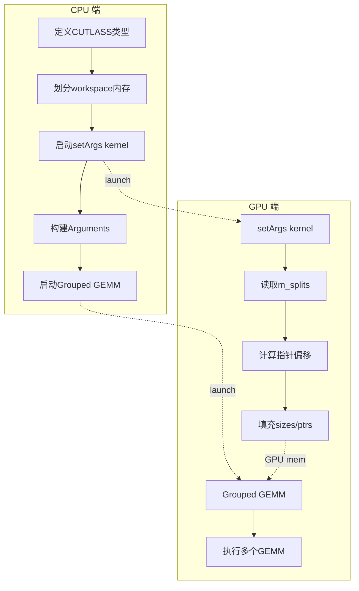
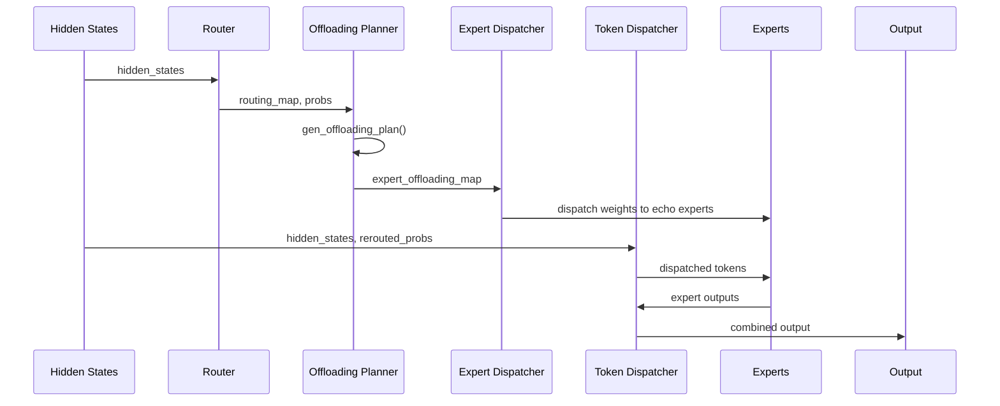

# 从Partial CUDA Graph到Full CUDA Graph

在上一篇[深入理解 Megatron-LM 中的 Partial CUDA Graph：MoE 模型训练加速的关键技术](https://magic3007.github.io/blog/llm/2025/12/30/training-cuda-graph-partial.html)中，我们分析了在MoE训练流程中，影响CUDA Graph兼容性的主要瓶颈是MoE部分的动态行为。在本文中，我们将深入探讨，为了使MoE部分能够无缝地融入CUDA Graph，并最终实现包含前向与反向传播在内的完整iteration的Full CUDA Graph捕获，需要对其结构做出哪些关键性改进。

具体而言，MoE与CUDA Graph的兼容性亟需解决以下三项核心技术难题：
1. 排除TE grouped GEMM中的CPU-GPU同步环节，实现与CUDA Graph的原生兼容；
2. 对HybridEP策略进行重构，使其运行逻辑与CUDA Graph协同无障碍；
实际上，完成上述两项优化后，在MoE强制负载均衡（load balancing）的设定下，已能够实现真正意义上的Full CUDA Graph。然而，由于HybridEP与CUDA Graph兼容性提升带来的静态缓冲区约束，我们还需进一步实现高效的Expert权重分发及梯度聚合机制，以充分释放CUDA Graph的性能潜力。

# 如何让TE启动grouped GEMM不需要GPU-CPU同步？
在MoE中，由于每个experts分到的token数量不同，实际上我们是在做grouped GEMM，[通常我们会调用transformer engine （TE）的grouped GEMM](https://github.com/NVIDIA/Megatron-LM/blob/1b110768dc0d890a61cc8416b1f8f02e42930111/megatron/core/transformer/moe/experts.py#L512)，也就是在[调用TEd的`pytorch.GroupedLinear`](https://github.com/NVIDIA/Megatron-LM/blob/1b110768dc0d890a61cc8416b1f8f02e42930111/megatron/core/extensions/transformer_engine.py#L1459)类。
一般来说，TE实现grouped GEMM主要是通过两个后端实现方式。
1. 调用cuBLAS作为后端实现方式。但是当前cuBLAS实际上并没有真正实现单个kernel launch grouped GEMM的形式，实际上[TE是循环调用多次cuBLAS kernel并分发到不同CUDA stream上实现的](https://github.com/NVIDIA/TransformerEngine/blob/5671fd3675906cda1ade26c24a65d3dedd88eb89/transformer_engine/common/gemm/cublaslt_gemm.cu#L984-L1009)（见下图的左图）。
2. 另外一个后端实现方式是cutlass。cutlass是有单个kernel launch grouped GEMM的支持的（见下图的右图）。


我们可以通过[环境变量`NVTE_USE_CUTLASS_GROUPED_GEMM`](https://github.com/NVIDIA/TransformerEngine/blob/5671fd3675906cda1ade26c24a65d3dedd88eb89/transformer_engine/common/gemm/cublaslt_gemm.cu#L1058)来控制使用cuBLAS还是cutlass。但是目前至少在TE 2.12版本里面，这个环境变量[只对H系列GPU起作用](https://github.com/NVIDIA/TransformerEngine/blob/5671fd3675906cda1ade26c24a65d3dedd88eb89/transformer_engine/common/gemm/cublaslt_gemm.cu#L1067C1-L1071C4)，在B系列上即使设置了这个环境变量也还是会fallback到使用cuBLAS中。在H系列芯片中，multi-stream的方式做grouped GEMM更快，但是在B系列芯片上，cuBLAS更快，因此我们后面的实现都考虑是cuBLAS作为后端。


TE 2.12启动grouped GEMM会有GPU-CPU同步主要是`torch.split`这个API带来的。在TE 2.12版本版本的代码中，[有这么一项](https://github.com/NVIDIA/TransformerEngine/blob/59f6f3876767d07045152bfae07b5dd4c54e1725/transformer_engine/pytorch/module/grouped_linear.py#L157)：
```python
inputmats = torch.split(cast_if_needed(inp_view, activation_dtype), m_splits_list)
```
torch.split要求m_splits_list这一项必须在CPU上。torch.split(inp_view, m_splits_list) 会将输入 tensor inp_view 按照 m_splits_list 中指定的大小切分成多个子 tensor，每个子 tensor 对应一个 expert 的输入。

m_splits_list就是tokens_per_expert，因此在Megatron-LM中，需要将tokens_per_expert从GPU转到CPU list。tokens_per_expert需要通过 .cpu().tolist() 将GPU上的tensor转换为CPU上的Python list。这个操作会触发GPU-CPU同步。

从另外一个层面上看，在TE 2.12版本中，m_splits虽然作为了参数传到到C++层面的[`te_general_grouped_gemm`](https://github.com/NVIDIA/TransformerEngine/blob/59f6f3876767d07045152bfae07b5dd4c54e1725/transformer_engine/pytorch/csrc/extensions/gemm.cpp#L408)，但是其实并没有用到，因为信息已经通过torch.split编码在 A[i].shape[0] 中。
但是在CUDA Graph的要求下，我们不能有GPU-CPU同步。因此我们需要把m_splits 作为 GPU tensor 传给 kernel，通过GPU操作完成类似`torch.split`的功能。

具体实现可以参考[这个文件](https://github.com/QiZhangNV/TransformerEngine/blob/cutlass_device_grouped_gemm_bf16/transformer_engine/common/gemm/cutlass_device_grouped_gemm_fp16bf16.cu)，此文件完成了TE 2.12还没有做到事情，·1）实现了在B系列上支持cuBLAS作为后端，2）不需要CPU-GPU同步来完成类似`torch.split`的功能。

对于第2点，其核心思想是，在启动 CUTLASS Grouped GEMM前，用一个轻量级 GPU kernel (`setGroupedGemmArguments_fp16bf16`) 来读取 GPU 上的 m_splits 并配置 GEMM 参数，整个过程无需 CPU 参与，因此不会触发 CPU-GPU 同步，使得 MoE 层可以完全被 CUDA Graph 捕获。
```c++
__global__ void setGroupedGemmArguments_fp16bf16(int num_experts, const int64_t *gemm_m_per_expert,
                                        int gemm_n, int gemm_k, ElementA *ptr_A, ElementD *ptr_D,
                                        UnderlyingProblemShape *problem_sizes,
                                        ElementA **ptr_A_list, StrideA *stride_A_list, StrideB *stride_B_list,
                                        ElementD **ptr_D_list, StrideD *stride_D_list) {
  uint64_t m_offset = 0;
  if (threadIdx.x == 0 && blockIdx.x == 0) {  // 只用一个线程执行
    for (int expert_id = 0; expert_id < num_experts; expert_id++) {
      int gemm_m = int(gemm_m_per_expert[expert_id]);  // <-- 直接从GPU读取m_splits
      problem_sizes[expert_id] = cute::make_shape(gemm_m, gemm_n, gemm_k);

      ptr_A_list[expert_id] = ptr_A + m_offset * gemm_k;  // 计算每个expert的A指针
      stride_A_list[expert_id] = cute::make_stride(int64_t(gemm_k), _1{}, _0{});
      // ...
      ptr_D_list[expert_id] = ptr_D + m_offset * gemm_n;  // 计算每个expert的D指针
      stride_D_list[expert_id] = cute::make_stride(int64_t(gemm_n), _1{}, _0{});

      m_offset += gemm_m;  // 累加偏移
    }
  }
}
```

对于第一点（实现了在B系列上支持cuBLAS作为后端），其整体流程如下：

这个函数名为`generic_moe_gemm_kernelLauncher_fp16bf16`，分为 4 个主要阶段：

* 阶段 1：定义CUTLASS 类型。使用 CUTLASS 的 Builder 模式定义高性能 Grouped GEMM kernel 的所有类型参数。
```c++
// 定义 GEMM 问题形状
using ProblemShape = cutlass::gemm::GroupProblemShape<Shape<int, int, int>>;  // <M,N,K>

// 配置矩阵类型和布局
using ElementA = ElementInput;  // FP16 或 BF16
using LayoutA = cutlass::layout::RowMajor;
using ElementAccumulator = float;  // 累加器用 FP32

// 核心配置：针对 SM100 (Blackwell) 架构
using ArchTag = cutlass::arch::Sm100;
using MmaTileShape = Shape<_256, _256, Int<128 / sizeof(ElementA)>>;  // Tile 大小
using KernelSchedule = cutlass::gemm::KernelPtrArrayTmaWarpSpecialized2SmSm100;  // TMA调度

// 构建 GEMM kernel
using GemmGrouped = cutlass::gemm::device::GemmUniversalAdapter<GemmKernel2SM>;
```

* 阶段 2：Workspace 内存布局。在预分配的 GPU workspace 中划分内存区域，用于存储各 expert 的参数。
```c++
// 在 workspace 中分配各种指针数组和 stride 数组
auto ptr_A_list = ...;     // 每个 expert 的 A 矩阵指针
auto ptr_D_list = ...;     // 每个 expert 的 D（输出）矩阵指针
auto stride_A_list = ...;  // 每个 expert 的 A stride
auto stride_B_list = ...;  // 每个 expert 的 B stride
auto stride_D_list = ...;  // 每个 expert 的 D stride
auto problem_sizes = ...;  // 每个 expert 的 GEMM shape (M, N, K)
```

* 阶段 3：启动参数设置 Kernel。启动一个小型 GPU kernel，在 GPU 上读取 gemm_m_per_expert（m_splits），并填充：
- problem_sizes[i] = (M_i, N, K) —— 每个 expert 的 GEMM 形状
- ptr_A_list[i] —— 每个 expert 的输入指针
- ptr_D_list[i] —— 每个 expert 的输出指针
- 各种 stride
```c++
setGroupedGemmArguments_fp16bf16<<<1, 32, 0, stream>>>(
    num_experts, gemm_m_per_expert,  // <-- m_splits (GPU tensor)
    gemm_n, gemm_k, ptr_A, ptr_D, problem_sizes,
    ptr_A_list, stride_A_list, stride_B_list,
    ptr_D_list, stride_D_list);
```

* 阶段 4：启动 CUTLASS Grouped GEMM。使用阶段 3 在 GPU 上设置好的参数，启动 CUTLASS Grouped GEMM kernel。
```c++
// 构建 CUTLASS 参数
args = typename GemmGrouped::Arguments{
    cutlass::gemm::GemmUniversalMode::kGrouped,
    {num_experts, problem_sizes, nullptr},  // 问题形状（在 GPU 上）
    {ptr_A_list, stride_A_list, ptr_B_list, stride_B_list},  // 输入
    {fusion_args, nullptr, stride_D_list, ptr_D_list, stride_D_list},  // 输出
    hw_info, scheduler
};

// 初始化并运行
gemm.initialize(args, workspace + offset);
gemm.run(stream);  // 执行 Grouped GEMM
```

# HybridEP支持CUDA Graph后有什么限制？

# Megatron的Full CUDA Graph支持

另外一个问题时，Megatron的Full CUDA Graph是否支持PP？，实际上Full CUDA Graph捕获的是整个 forward_backward_func 的执行，而不是单个 layer 或单个 stage。forward_backward_func 内部会处理所有 PP stages 的前向传播、反向传播以及 microbatch 的调度（如 1F1B 调度）。因此一个 CUDA Graph 就包含了所有 PP stages 的计算，所有 microbatches 的处理以及PP stages 之间的通信（send/recv）。

```python
        if curr_iteration == self.cuda_graph_warmup_steps:
            logger.info(f'Capture CUDA graph for {training_str}!!!')
            torch.distributed.barrier()
            assert FullCudaGraphWrapper.cuda_graph[training_str] is None
            FullCudaGraphWrapper.cuda_graph[training_str] = torch.cuda.CUDAGraph()
            # ... 注册 RNG states
            with torch.cuda.graph(
                FullCudaGraphWrapper.cuda_graph[training_str],
                stream=capture_stream,
                capture_error_mode="thread_local",
            ):
                # 捕获整个 forward_backward_func，包含所有 PP stages
                FullCudaGraphWrapper.result[training_str] = self.forward_backward_func(
                    *args, **kwargs
                )

```

同时我们也能看到，在数据读取上是支持多stage PP的：
```python
    def data_read(self, data_iterator, model, training, num_microbatches):
        """Read all microbatch inputs from Dataloader and copy to static buffers."""
        if not isinstance(model, list) or len(model) == 1:
            # 单 stage 场景（无 PP 或 PP size = 1）
            assert not isinstance(data_iterator, list) or len(data_iterator) == 1
            # ... 处理单个 data_iterator
        else:
            # 多 stage 场景（PP size > 1）
            assert isinstance(data_iterator, list) and len(data_iterator) == len(model)
            data_list = []
            for i in range(len(model)):
                if data_iterator[i] is not None:
                    # 为每个 PP stage 分别读取 microbatch 数据
                    data_list_i = []
                    for b in range(num_microbatches):
                        data_list_i.append(...)
                    data_list.append(iter(data_list_i))
                else:
                    data_list.append(None)
```
因此无论 PP 有多少个 stage，只会创建 2 个 CUDA Graph：1 个用于 training，1 个用于 validation。
```python
    curr_iteration = {'training': 0, 'validation': 0}
    cuda_graph = {'training': None, 'validation': None}
    result = {'training': None, 'validation': None}
```

# Expert权重分发与梯度收集机制




## 如何决定home experts复制到哪些redundant expert slots？

gen_intermediate是为了计算每个EP rank的空闲容量和每个local expert的计算溢出量：
```python
def gen_intermediate(count_tokens_per_expert_from_ep_rank, ...):
    # 步骤1: 计算每个EP rank的token总数和平均值
    count_tokens_per_ep_rank = count_tokens_per_expert.view(num_ep_ranks, -1).sum(dim=1)
    avg_tokens_per_ep_rank = count_tokens_per_ep_rank.sum() // num_ep_ranks
    
    # 步骤2: 计算spare容量 = max(0, avg - current)
    # 负载低于平均的EP rank有空闲容量接收tokens
    deviation = count_tokens_per_ep_rank - avg_tokens_per_ep_rank
    capacity_spare_per_ep_rank = torch.relu(-deviation)
    
    # 步骤3: 计算spillover（溢出量）
    # 关键思路：对每个EP rank内的专家按token数排序，
    # 累积求和后超过平均值的部分就是spillover
    count_tokens_sorted, indices_sorted = count_tokens_per_expert.view(num_ep_ranks, -1).sort(dim=1)
    spillover_cumsum = (count_tokens_sorted.cumsum(dim=1) - avg_tokens_per_ep_rank).clamp(min=0)
    # 从cumsum转回每个专家的spillover
    count_spillover_sorted = torch.cat([spillover_cumsum[:, :1], 
                                         torch.diff(spillover_cumsum, dim=1)], dim=1)
```
`capacity_spare_per_ep_rank`是一个EP Rank层级的变量，表示当前EP Rank超出了多少token需要重新分配，这个很好理解：
```
                    avg = 350
                        │
EP0: 500 ■■■■■■■■■■■■■■■│■■■■  超额 150 → spillover
EP1: 200 ■■■■■■         │      空闲 150 → spare capacity  
EP2: 300 ■■■■■■■■■      │      空闲  50 → spare capacity
EP3: 400 ■■■■■■■■■■■■   │■     超额  50 → spillover
                        │
```

okk。现在我们知道了本地EP rank应该要offload多少token出来，但是一个EP rank有多个local expert，我们怎么知道每个expert应该要分多少token出来。使得这个数刚好等于本地的capacity_spare_per_ep_rank？

计算spillover的直观理解：假设一个 EP rank 有 4 个专家，tokens 分布为 [50, 100, 150, 200]，平均值为 250（注意这个平均值是所有EP rank的平均值）：
- 排序后: [50, 100, 150, 200]
- 累积和: [50, 150, 300, 500]
- 减去平均值后: [-200, -100, 50, 250]
- clamp(min=0): [0, 0, 50, 250]
- 差分得到spillover: [0, 0, 50, 200]。
我们看到，token数总和为1000，

一个要思考的问题为什么我们这里要先做累积和然后做差分得到spillover？直接tokens 分布减去平均值可以吗？
我们先考虑直接减法有什么问题：
```
spillover = (tokens_per_expert - avg_per_expert).clamp(min=0)
# avg_per_expert = 250 / 4 = 62.5

# 结果：
专家0: (50 - 62.5).clamp(0) = 0
专家1: (100 - 62.5).clamp(0) = 37.5
专家2: (150 - 62.5).clamp(0) = 87.5
专家3: (200 - 62.5).clamp(0) = 137.5
───────────────────────────────────
总 spillover: 262.5 tokens  ← 超过了需要的 250！
```
这样的问题是这样计算会导致 spillover 过多，因为每个专家独立判断"超额"。

如果我们采用前缀和加上差分的思想：
```python
# Step 1: 排序（从小到大）
sorted_tokens = [50, 100, 150, 200]

# Step 2: 累积和
cumsum = [50, 150, 300, 500]

# Step 3: 减去平均值并 clamp
spillover_cumsum = ([50, 150, 300, 500] - 250).clamp(min=0)
                 = [-200, -100, 50, 250].clamp(min=0)
                 = [0, 0, 50, 250]

# Step 4: 差分得到每个专家的 spillover
spillover = [0, 0-0, 50-0, 250-50]
          = [0, 0, 50, 200]

总 spillover: 250 tokens  ← 正好等于超额部分！
```

其核心思想是当累积和超过平均值时，才开始 spillover；同时差分将"整体超额"按贡献分配给各专家。
```
tokens:     50      100      150      200
            │        │        │        │
cumsum:     50 ──── 150 ──── 300 ──── 500
            │        │        │        │
            │        │        │        │
avg=250 ────│────────│────────┼────────│────
            │        │        ↑        ↑
            │        │     超出50   超出250
            │        │        │        │
spillover:  0        0       50      200
                             └────────┘
                             差分: 250-50=200
```

另外，我们排序为了让负载轻的专家优先保留自己的 tokens：
```
未排序 [200, 50, 150, 100]:
cumsum = [200, 250, 400, 500]
spillover_cumsum = [0, 0, 150, 250]  ← 从专家0开始就接近平均值
spillover = [0, 0, 150, 100]

排序后 [50, 100, 150, 200]:
cumsum = [50, 150, 300, 500]
spillover_cumsum = [0, 0, 50, 250]   ← 更晚才超过平均值
spillover = [0, 0, 50, 200]
```
排序后，小专家贡献的 spillover 更少，大专家贡献更多,这样可以更公平的负载均衡。

有了这个数值之后，我们使用贪心分配算法`one_shot_greedy_assignment`：来求解这个问题：

```python
def one_shot_greedy_assignment(count_tokens_per_chunk, capacity_per_bucket):
    """
    使用区间重叠计算实现一次性贪心分配
    
    原理：
    - 将所有token chunks看作连续区间 [start, end)
    - 将所有bucket容量看作连续区间 [start, end)
    - 计算每对 (chunk, bucket) 的区间重叠作为分配量
    """
    # 计算累积和得到区间端点
    chunks_cumsum = torch.cumsum(count_tokens_per_chunk, dim=0)
    buckets_cumsum = torch.cumsum(capacity_per_bucket, dim=0)
    
    chunk_start = chunks_cumsum - count_tokens_per_chunk  # [0, c1, c1+c2, ...]
    chunk_end = chunks_cumsum                              # [c1, c1+c2, ...]
    bucket_start = buckets_cumsum - capacity_per_bucket   
    bucket_end = buckets_cumsum
    
    # 计算重叠
    overlap_start = torch.maximum(chunk_start[:, None], bucket_start[None, :])
    overlap_end = torch.minimum(chunk_end[:, None], bucket_end[None, :])
    assignment = (overlap_end - overlap_start).clamp(min=0)
```

举个例子：chunks = [100, 150], buckets = [80, 120]
```
chunks:  |---100---|---150---|
buckets: |--80--|----120----|

cumsum:  [100, 250] 和 [80, 200]
chunk区间: [0,100), [100,250)
bucket区间: [0,80), [80,200)

重叠矩阵:
         bucket0   bucket1
chunk0   [0,80)∩[0,100)=80   [80,100)∩[100,250)=0  → [80, 0]
chunk1   [0,80)∩[100,250)=0  [80,200)∩[100,250)=100 → [0, 100]
```

```
# 每个专家的 spillover（已计算好）
count_spillover_per_home_expert = [0, 80, 0, 0, 50, 100, 0, 30]
# 专家编号:                        0   1   2   3   4    5   6   7

# 每个 EP rank 的 spare capacity
capacity_spare_per_ep_rank = [0, 120, 60, 0]
# EP rank:                    0    1   2   3
```


```
# 对 spillover 降序排序
count_spillover_sorted = [100, 80, 50, 30, 0, 0, 0, 0]
indices_spillover_sort = [5,   1,  4,  7, 0, 2, 3, 6]  # 原始专家编号

# 对 spare capacity 降序排序  
capacity_spare_sorted = [120, 60, 0, 0]
indices_spare_sort = [1,   2,  0, 3]  # 原始 EP rank 编号
```

为什么排序？ 把最大的 spillover 和最大的 capacity 排在前面，方便贪心分配。


这是核心算法，使用区间重叠技术：
```
def one_shot_greedy_assignment(chunks, buckets):
    """
    chunks = spillover_sorted = [100, 80, 50, 30, 0, 0, 0, 0]  (待分配的量)
    buckets = capacity_sorted = [120, 60, 0, 0]                 (可接收的容量)
    """
```


```
chunks 累积和:  [100, 180, 230, 260, 260, 260, 260, 260]
buckets 累积和: [120, 180, 180, 180]

chunks 区间:
  chunk 0: [0, 100)      spillover=100
  chunk 1: [100, 180)    spillover=80
  chunk 2: [180, 230)    spillover=50
  chunk 3: [230, 260)    spillover=30
  chunk 4-7: 空 (spillover=0)

buckets 区间:
  bucket 0: [0, 120)     capacity=120
  bucket 1: [120, 180)   capacity=60
  bucket 2-3: 空 (capacity=0)
```

```
                0        100       120       180       230      260
                │         │         │         │         │        │
chunks:         │◄─chunk0─┼─────────►◄chunk1─►│◄chunk2─►│◄chunk3►│
                │   100   │         │   80    │   50    │   30   │
                │         │         │         │         │        │
buckets:        │◄──────bucket0────►│◄bucket1►│         │        │
                │        120        │   60    │         │        │
                │         │         │         │         │        │
```


重叠矩阵 [8 experts × 4 ep_ranks]:

```
              bucket0   bucket1   bucket2   bucket3
              [0,120)   [120,180) [180,180) [180,180)
chunk0 [0,100)    100        0        0        0
chunk1 [100,180)   20       60        0        0
chunk2 [180,230)    0        0        0        0    (bucket1 结束于 180)
chunk3 [230,260)    0        0        0        0
chunk4-7           0        0        0        0

assignment_sorted = 
[[100,  0, 0, 0],
 [ 20, 60, 0, 0],
 [  0,  0, 0, 0],
 [  0,  0, 0, 0],
 [  0,  0, 0, 0],
 [  0,  0, 0, 0],
 [  0,  0, 0, 0],
 [  0,  0, 0, 0]]

```


当 num_spare_experts_per_ep_rank > 1 时，每个 EP rank 可以接收多个专家的 offload：
```
假设 num_spare_experts_per_ep_rank = 2:

EP1 有 2 个 spare experts，可以接收 2 个不同专家的 offload
→ 从 assignment 矩阵的 EP1 列中选 top-2 个最大值
→ 得到 2 个 (home_expert, offload_amount) 对
```

gen_assignment / one_shot_greedy_assignment 只决定了：
- 专家级别的分配："专家 A 要 offload 100 tokens 到 spare expert X"
但它没有决定：
- EP rank 级别的分配："专家 A 的 100 tokens 中，多少来自 EP0，多少来自 EP1..."
因为同一个专家可能收到来自多个 EP ranks 的 tokens！

```
                     专家 A (home expert)
                     总 spillover = 100
                           │
         ┌─────────────────┼─────────────────┐
         │                 │                 │
      来自 EP0          来自 EP1          来自 EP2
       30 tokens        50 tokens        20 tokens
         │                 │                 │
         └─────────────────┼─────────────────┘
                           │
                           ▼
                   需要决定怎么分配！
```

两阶段分配流程
```
┌─────────────────────────────────────────────────────────────────────────────┐
│                          两阶段分配流程                                       │
├─────────────────────────────────────────────────────────────────────────────┤
│                                                                              │
│  输入: count_tokens_per_expert_from_ep_rank [ep_size, num_experts]           │
│        count_tokens_from_home_expert_to_spare_expert [num_experts, num_spare]│
│                                                                              │
│  ┌─────────────────────────────────────────────────────────────────┐        │
│  │ Phase 1: breadth_first_allocation (广度优先)                      │        │
│  │                                                                   │        │
│  │ 策略：按比例分配，让每个 EP rank 公平贡献                          │        │
│  │                                                                   │        │
│  │ EP0 贡献: 30/100 * capacity = 30% 的 offload 量                   │        │
│  │ EP1 贡献: 50/100 * capacity = 50% 的 offload 量                   │        │
│  │ EP2 贡献: 20/100 * capacity = 20% 的 offload 量                   │        │
│  │                                                                   │        │
│  │ 使用 floor() 取整，可能有剩余                                      │        │
│  └─────────────────────────────────────────────────────────────────┘        │
│                              │                                               │
│                              ▼                                               │
│  ┌─────────────────────────────────────────────────────────────────┐        │
│  │ Phase 2: depth_first_allocation (深度优先)                        │        │
│  │                                                                   │        │
│  │ 处理 Phase 1 的取整误差导致的剩余容量                              │        │
│  │ 使用区间重叠算法填满剩余空间                                        │        │
│  └─────────────────────────────────────────────────────────────────┘        │
│                              │                                               │
│                              ▼                                               │
│  输出: 每个 EP rank 具体 offload 多少 tokens 到每个 spare expert             │
│                                                                              │
└─────────────────────────────────────────────────────────────────────────────┘
```

```
3 个 EP ranks，专家 A 的 tokens 分布:
  - 来自 EP0: 30 tokens
  - 来自 EP1: 50 tokens  
  - 来自 EP2: 20 tokens
  - 总计: 100 tokens

gen_assignment 决定: 专家 A offload 80 tokens 到 spare expert X
```

Phase 1: breadth_first_allocation（按比例分配）
```python
# 找到主要供应者（argmax）

idx_supplier = argmax([专家A的offload量]) = 专家A


# 计算每个 EP rank 的贡献比例
count_tokens_rel = [30, 50, 20] # 各 EP rank 发给专家 A 的 tokens
probs_proportional = [30/100, 50/100, 20/100] = [0.3, 0.5, 0.2]

# 按比例分配 capacity=80

count_tokens_ideal = [0.3*80, 0.5*80, 0.2*80] = [24, 40, 16]

# 取整（floor）
count_tokens_floors = [24, 40, 16] # 正好，无余数
```

结果是：
```
EP0 offload 24 tokens 到 spare X
EP1 offload 40 tokens 到 spare X
EP2 offload 16 tokens 到 spare X
─────────────────────────────────
总计: 80 tokens ✓
```

如果有取整误差？怎么办？

```
假设 capacity = 83（不能被整除）

count_tokens_ideal = [0.3*83, 0.5*83, 0.2*83] = [24.9, 41.5, 16.6]
count_tokens_floors = floor([24.9, 41.5, 16.6]) = [24, 41, 16]

总计 = 24 + 41 + 16 = 81 < 83

剩余容量 = 83 - 81 = 2 tokens
```

Phase 2: depth_first_allocation（填充剩余）

```
# 剩余容量
capacity_spare_remaining = 2

# 各 EP rank 剩余可 offload 的 tokens
# EP0: 30 - 24 = 6 tokens 还没 offload
# EP1: 50 - 41 = 9 tokens 还没 offload
# EP2: 20 - 16 = 4 tokens 还没 offload

# 使用区间重叠贪心分配
# 按 EP rank 顺序（EP0 → EP1 → EP2）填充剩余容量 2
# EP0 再贡献 2 tokens（因为 6 > 2）

second_pass_offload = [2, 0, 0]
```

最终结果是：
```
EP0 offload: 24 + 2 = 26 tokens
EP1 offload: 41 + 0 = 41 tokens
EP2 offload: 16 + 0 = 16 tokens
─────────────────────────────────
总计: 83 tokens ✓
```

为什么叫为什么叫"广度优先"和"深度优先"？
```
            专家A        专家B        专家C
              │            │            │
   ┌──────────┼──────────┐ │ ┌──────────┼──────────┐
   │          │          │ │ │          │          │
  EP0        EP1        EP2 ... ...

广度优先 (Breadth-First):
  先按比例分配所有专家的所有 EP ranks
  → 横向扫描，保证公平性

深度优先 (Depth-First):
  处理剩余，一个专家一个专家地填满
  → 纵向扫描，最大化利用率
```

两阶段设计保证了：
1. 公平性：各 EP rank 按比例贡献（广度优先）
2. 完整性：剩余容量被完全利用（深度优先）

## 每个EP rank都运行gen_offloading_plan算法，得到的结果是一样的吗？
每个 EP rank 都独立运行这个算法。关键在于输入的构成：
```python
# Step 1: 局部信息 - 每个 EP rank 不同
tokens_per_expert_local = routing_map.sum(dim=0).long()  # 本 EP rank 的 token 分布

# Step 2: 全局信息 - 通过 AllGather 收集，所有 EP ranks 相同
tokens_per_expert_per_ep_rank = gather_from_sequence_parallel_region(
    tokens_per_expert_local,
    group=self.ep_group,
).reshape(ep_size, num_experts)  # [ep_size, num_experts]

# Step 3: 调用 gen_offloading_plan
rerouted_routing_map, rerouted_probs, expert_offloading_map = gen_offloading_plan(
    map_token_to_expert=routing_map,                      # 局部：每个 EP rank 不同
    probs_routing=probs,                                   # 局部：每个 EP rank 不同
    count_tokens_per_expert_from_ep_rank=tokens_per_expert_per_ep_rank,  # 全局：相同
    ep_rank=ep_rank,                                       # 不同：0, 1, 2, ...
    num_ep_ranks=ep_size,                                  # 相同
    ...
)
```

在`gen_offloading_plan`内部，`expert_offloading_map` 所有 EP ranks 相同，因为这个映射只依赖于 `count_tokens_per_expert_from_ep_rank`（全局 token 分布），与局部 routing_map 无关。

```python
# gen_offloading_plan 内部
count_tokens_from_home_expert_to_spare_expert = gen_assignment(
    count_tokens_per_expert_from_ep_rank,  # 全局相同的输入
    ...
)
map_home_expert_to_spare = count_tokens_from_home_expert_to_spare_expert > 0
```

但是`rerouted_routing_map` 和 `rerouted_probs`每个 EP rank 不同，因为每个 EP rank 只重路由自己的 tokens。

```python
# reroute_tokens_triton 使用局部信息
map_token_to_all_experts, probs_rerouted = reroute_tokens_triton(
    map_token_to_expert,                          # 局部 routing_map
    probs_routing,                                # 局部 probs
    count_tokens_offloaded_from_ep_rank[ep_rank], # 根据 ep_rank 选择
    count_tokens_offloaded_to_spare[ep_rank],     # 根据 ep_rank 选择
    ...
)
```

