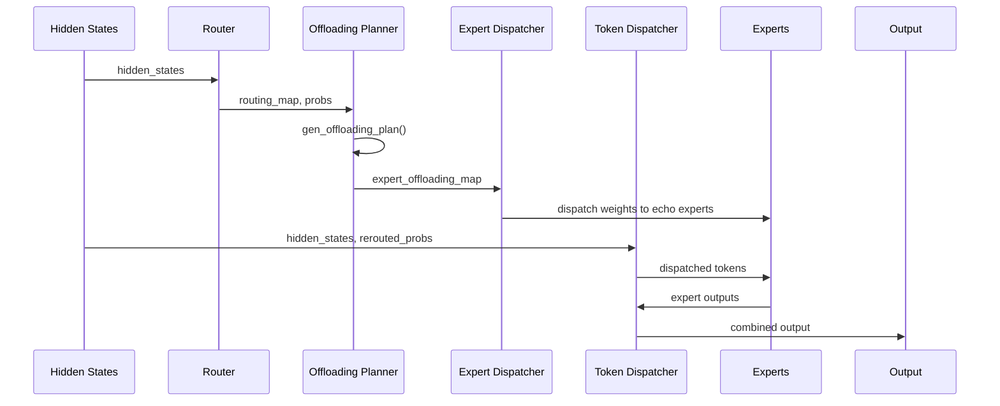

# 从 Partial CUDA Graph 到 Full CUDA Graph

在上一篇[深入理解 Megatron-LM 中的 Partial CUDA Graph：MoE 模型训练加速的关键技术](https://magic3007.github.io/blog/llm/2025/12/30/training-cuda-graph-partial.html)中，我们分析了 MoE 训练流程中影响 CUDA Graph 兼容性的主要瓶颈在于 MoE 部分的动态行为 —— 每个 expert 在每次 iteration 中接收的 token 数量都不同，导致 kernel 参数、缓冲区大小和通信模式无法在捕获时固定。
本文将深入探讨如何逐一攻克这些障碍，使 MoE 部分能够无缝融入 CUDA Graph，并最终实现覆盖前向与反向传播的完整 iteration 的 **Full CUDA Graph** 捕获。与 Partial CUDA Graph（仅捕获 Attention、MLP 等确定性模块）不同，Full CUDA Graph 会将整个训练 iteration（包括 MoE 层）作为一个完整的 GPU 执行图进行捕获和重放，从而最大程度地消除 CPU 开销。
为了解决 MoE 与 CUDA Graph 的兼容性，首先需要攻克以下两个核心技术难题：

1. **消除 TE grouped GEMM 中的 CPU-GPU 同步**：当前 TE 在启动 grouped GEMM 时依赖 `torch.split`，该操作要求将 GPU 上的 `tokens_per_expert` 转移至 CPU，这会触发隐式同步，破坏 CUDA Graph 的捕获流程。
2. **重构 HybridEP 策略以兼容 CUDA Graph**：HybridEP 的 token 分发逻辑仍包含动态内存分配和条件分支，需要重构为静态缓冲区 + 固定执行路径模式。这一点其实在 HybridEP 2025 年底的[几个 commit](https://github.com/deepseek-ai/DeepEP/compare/main...hybrid-ep) 中都有所涉及，我们可以认为现在的 HybridEP 版本已经兼容 CUDA Graph 了。

实际上，完成上述两项优化后，在 MoE 强制负载均衡（force load balancing）设定下，已经可以实现真正意义上的 Full CUDA Graph。然而，在实际训练中并不会采用 force load balancing；而由于 CUDA Graph 需要静态特性，我们也无法在每个 EP Rank 上为极端不均衡的情况预留过大的缓冲区。因此，我们还需要结合 MoE 的负载均衡算法，并**实现高效的 Expert 权重分发与梯度聚合机制**，同时保持与 CUDA Graph 的兼容，以便在真实场景下安全、高效地使用 Full CUDA Graph。

在接下来的内容中，我们会调整行文顺序：先讨论 CUDA Graph 兼容的 MoE 负载均衡算法，再讨论如何实现高效的 Expert 权重分发与梯度聚合机制，接着介绍 Megatron Full CUDA Graph 的整体实现机制，最后介绍如何解决 TE grouped GEMM 的 CPU-GPU 同步问题。
# MoE 负载规划算法

为了实现 MoE 的负载均衡，我们引入了 **redundant expert slots**（冗余专家槽位）的概念。每个 EP rank 需要预先分配固定数量的 expert 计算槽位。当某些 EP rank 的负载过重（即分配到的 token 数远超平均值）时，可以将部分 token **offload** 到负载较轻的 EP rank 的空闲槽位上处理。这就需要一套机制来决定：哪些 expert 的权重需要被复制到哪些 redundant expert slots 上，这个机制我们称之为 expert dispatch。我们可以在后文中看到，实际上 expert dispatch 和 token dispatch 非常像，甚至都可以复用 HybridEP 这套通信库。

下图展示了前向过程中整个 expert dispatch 和 token dispatch 的工作流程：


```mermaid
sequenceDiagram
    participant Input as Hidden States
    participant Router
    participant Planner as Offloading Planner
    participant ExpertDisp as Expert Dispatcher
    participant TokenDisp as Token Dispatcher
    participant Experts
    participant Output

    Input->>Router: hidden_states
    Router->>Planner: routing_map, probs
    Planner->>Planner: gen_offloading_plan()
    Planner->>ExpertDisp: expert_offloading_map
    ExpertDisp->>Experts: dispatch weights to echo experts
    Input->>TokenDisp: hidden_states, rerouted_probs
    TokenDisp->>Experts: dispatched tokens
    Experts->>TokenDisp: expert outputs
    TokenDisp->>Output: combined output
```


假设现在我们已经有了一个 router 生成的路由方案，即我们知道每个 EP rank 上每个 home expert 会收到多少 token。我们现在要做 MoE 的**负载规划**，即决定每个 EP rank 上的每个 home expert 要将其权重分发到哪个 EP rank 的 redundant expert slots 上，并同时决定原本路由到该 home expert 的 token 中有多少要改为路由到这个 redundant expert slot 上。
这里有三个层级的考虑：

1. 第一个层级是要考虑每个 EP Rank 上的**空闲容量**（spare capacity）。空闲容量表示一个 EP rank 还能额外处理多少 token，我们肯定不能将太多的 token 重路由到一个 EP rank 上，我们希望转移后每个 EP Rank 上的计算量更加均衡。
2. 第二个层级是 home expert 上的，我们想要计算每个 home expert 的**溢出量**（spillover）。溢出量表示一个 home expert 有多少 token 需要被转移到其他 EP rank 上处理，在这个层级我们希望尽可能减少 expert 权重分发的通信量。比如说，假设某个 home expert 只被安排了转移 1 个 token 的计算到其他 redundant expert slot 上，但是我们却需要将整个 expert 权重分发到这个 redundant expert slot 上，显然这是非常不合算的。
3. 第三个层级是专家权重的分配。有了每个 EP rank 的 spare capacity 和每个 home expert 的 spillover 之后，每个 home expert 的权重应该被分配到哪个 EP rank 的 spare slot 上。

我们一步步来解决这些问题。

## 基于前缀和的分摊算法

我们在这一节中考虑第一层级和第二层级的事情。首先考虑每个 EP rank 上的 spare capacity 如何计算：
```python
def gen_intermediate(count_tokens_per_expert_from_ep_rank, ...):
    # 步骤1: 计算每个EP rank的token总数和平均值
    count_tokens_per_ep_rank = count_tokens_per_expert.view(num_ep_ranks, -1).sum(dim=1)
    avg_tokens_per_ep_rank = count_tokens_per_ep_rank.sum() // num_ep_ranks
    
    # 步骤2: 计算spare容量 = max(0, avg - current)
    # 负载低于平均的EP rank有空闲容量接收tokens
    deviation = count_tokens_per_ep_rank - avg_tokens_per_ep_rank
    capacity_spare_per_ep_rank = torch.relu(-deviation)
    
    # 步骤3: 计算spillover（溢出量）
    # 关键思路：对每个EP rank内的专家按token数排序，
    # 累积求和后超过平均值的部分就是spillover
    count_tokens_sorted, indices_sorted = count_tokens_per_expert.view(num_ep_ranks, -1).sort(dim=1)
    spillover_cumsum = (count_tokens_sorted.cumsum(dim=1) - avg_tokens_per_ep_rank).clamp(min=0)
    # 从cumsum转回每个专家的spillover
    count_spillover_sorted = torch.cat([spillover_cumsum[:, :1], 
                                         torch.diff(spillover_cumsum, dim=1)], dim=1)
```
空闲容量的计算非常简单：超过均值的部分要转移到其他 EP rank，没有达到均值的 EP rank 就有空闲容量来承载转移。下面通过一个直观的例子来理解：假设有 4 个 EP ranks，每个 EP rank 上有 4 个 home experts（共 16 个 experts，编号 0-15），token 总数为 1000，平均每个 EP rank 应处理 250 个 token：
```
                avg = 250
                    │
EP0: 500 ■■■■■■■■■■│■■■■■■■■■■  超额 250 → 转移到其他EP rank
EP1: 350 ■■■■■■■   │■■■           超额 100 → 转移到其他EP rank
EP2: 100 ■■        │              空闲 150 → spare capacity
EP3:  50 ■         │              空闲 200 → spare capacity
                    │
```

现在我们知道了每个 EP rank 整体需要 offload 多少 token。接下来考虑第二个问题：**如何设计一种分摊算法，将 EP rank 层级的溢出量分摊到各个 expert 上，使得各 expert 的 spillover 之和恰好等于该 EP rank 的总溢出量？** 注意在这个问题里面，我们希望将 expert 权重分发的代价尽可能小，尽可能不要出现分发了一次 expert 权重但是只为了转移一个 token 的情况。

为此，我们算法设计的思想是：**负载较轻的专家优先保留自己的 tokens，而负载较重的专家承担更多的 spillover**。分摊算法如下：以上面的 EP0 为例，假设其有 4 个 experts（编号 0-3），tokens 分布为 [50, 100, 150, 200]（总和 500），avg_tokens_per_ep_rank 为 250：
```python
# Step 1: 排序（从小到大）
sorted_tokens = [50, 100, 150, 200]

# Step 2: 累积和
cumsum = [50, 150, 300, 500]

# Step 3: 减去平均值并 clamp
spillover_cumsum = ([50, 150, 300, 500] - 250).clamp(min=0)
                 = [-200, -100, 50, 250].clamp(min=0)
                 = [0, 0, 50, 250]

# Step 4: 差分得到每个专家的 spillover
spillover = [0, 0-0, 50-0, 250-50]
          = [0, 0, 50, 200]

# 总 spillover: 250 tokens  ← 正好等于超额部分！
```
我们看到，这 4 个专家的 token 总和为 500，总 spillover 为 0+0+50+200=250，恰好等于该 EP rank 的超额量（500-250=250）。
这里的排序步骤很重要，它确保负载较轻的专家优先保留自己的 tokens，而负载较重的专家承担更多的 spillover，这更加符合我们设计算法的直觉。
```python 
# 未排序 [200, 50, 150, 100]:
cumsum = [200, 250, 400, 500]
spillover_cumsum = [0, 0, 150, 250]  # ← 从专家0开始就接近平均值
spillover = [0, 0, 150, 100]

# 排序后 [50, 100, 150, 200]:
cumsum = [50, 150, 300, 500]
spillover_cumsum = [0, 0, 50, 250]   # ← 更晚才超过平均值
spillover = [0, 0, 50, 200]
```

类似地，对 EP1（experts 4-7，tokens 分布 [50, 80, 100, 120]，总和 350）应用同样的算法：cumsum 为 [50, 130, 230, 350]，减去 250 后 clamp 得到 [0, 0, 0, 100]，差分得 spillover = [0, 0, 0, 100]。也就是说，EP1 超额的 100 个 token 全部由 expert 7（120 tokens，最大）承担。

至此，我们得到所有 16 个 experts 的 spillover 与每个 EP rank 的 spare capacity，可以直接送入下一节的匹配算法：
```python
count_spillover_per_home_expert = [0, 0, 50, 200, 0, 0, 0, 100, 0, 0, 0, 0, 0, 0, 0, 0]
# 专家编号:                        0  1  2   3   4  5  6   7   8  9 10 11 12 13 14 15
# (experts 0-3 在 EP0，4-7 在 EP1，8-11 在 EP2，12-15 在 EP3)

capacity_spare_per_ep_rank = [0, 0, 150, 200]
# EP rank:                    0  1   2    3
```

## 基于区间重叠的匹配算法

有了每个 EP rank 的 spare capacity 和每个 home expert 的 spillover 之后，下一步是决定：**每个 home expert 的溢出 token 应该被分配到哪个 EP rank 的 redundant expert slot 上。**

我们首先考虑一个简单一点的问题：home expert 到 EP rank 的映射问题。我们通过一个贪心分配算法 `one_shot_greedy_assignment` 来求解。它的核心思想是把每个 home expert 的 spillover 和每个 EP rank 的 spare capacity 都视为一维数轴上的连续区间，通过计算区间重叠来确定分配方案。

我们沿用上一节得到的输入：
```python
# 每个专家的 spillover（来自上一节的计算）
count_spillover_per_home_expert = [0, 0, 50, 200, 0, 0, 0, 100, 0, 0, 0, 0, 0, 0, 0, 0]
# 专家编号:                        0  1  2   3   4  5  6   7   8  9 10 11 12 13 14 15

# 每个 EP rank 的 spare capacity
capacity_spare_per_ep_rank = [0, 0, 150, 200]
# EP rank:                    0  1   2    3
```

我们分别对 spillover 和 spare capacity 降序排序，这里降序排序的目的是"大的优先匹配"，将最大的 spillover 和最大的 capacity 排在前面，确保大块的溢出量优先被大容量的 EP rank 吸收，避免碎片化分配。
```python
# 对 spillover 降序排序
count_spillover_sorted = [200, 100, 50, 0, 0, 0, 0, 0, 0, 0, 0, 0, 0, 0, 0, 0]
indices_spillover_sort = [3,   7,   2, 0, 1, 4, 5, 6, 8, 9,10,11,12,13,14,15]  # 原始专家编号

# 对 spare capacity 降序排序
capacity_spare_sorted = [200, 150, 0, 0]
indices_spare_sort    = [3,   2,   0, 1]  # 原始 EP rank 编号
```

接下来，我们直接进行区间重叠即可：

```python
# 输入：
chunks  = spillover_sorted = [200, 100, 50, 0, 0, 0, 0, 0, 0, 0, 0, 0, 0, 0, 0, 0]  # 待分配的量
buckets = capacity_sorted  = [200, 150, 0, 0]                                       # 可接收的容量

# 算法运行过程：
chunks 累积和:  [200, 300, 350, 350, 350, 350, ...]
buckets 累积和: [200, 350, 350, 350]

chunks 区间:
  chunk 0: [0,   200)    spillover=200
  chunk 1: [200, 300)    spillover=100
  chunk 2: [300, 350)    spillover=50
  chunk 3-15: 空 (spillover=0)

buckets 区间:
  bucket 0: [0,   200)   capacity=200
  bucket 1: [200, 350)   capacity=150
  bucket 2-3: 空 (capacity=0)
```
可视化图如下：
```python
                0                 200       300      350
                │                  │         │        │
chunks:         │◄──────chunk0────►│◄chunk1─►│◄chunk2►│
                │       200        │   100   │   50   │
                │                  │         │        │
buckets:        │◄──────bucket0───►│◄────bucket1─────►│
                │       200        │       150        │
                │                  │         │        │
```
我们可以进一步得到输出的 assignment 矩阵，这个矩阵的大小是 [num_total_experts, num_ep_ranks]，表示**所有 EP rank 上的 home experts 应该 offload 多少 token 到其他 EP rank**。注意此时 assignment 矩阵考虑了所有 EP rank 上的 home experts。

```python
                  bucket0    bucket1    bucket2    bucket3
                  [0,200)    [200,350)  [350,350)  [350,350)
chunk0 [0,200)      200          0          0          0
chunk1 [200,300)      0        100          0          0
chunk2 [300,350)      0         50          0          0   (bucket1 结束于 350)
chunk3-15             0          0          0          0

assignment_sorted =
[[200,   0, 0, 0],
 [  0, 100, 0, 0],
 [  0,  50, 0, 0],
 [  0,   0, 0, 0],
 ...                        # 余下的行全部为 0
 [  0,   0, 0, 0]]
```

按 `indices_spillover_sort` 与 `indices_spare_sort` 反映射回原始编号，可以得到：
* sorted chunk 0（= 原始 expert 3）→ sorted bucket 0（= EP3）：200 tokens
* sorted chunk 1（= 原始 expert 7）→ sorted bucket 1（= EP2）：100 tokens
* sorted chunk 2（= 原始 expert 2）→ sorted bucket 1（= EP2）：50 tokens

但是上面的算法还有一个小问题：它只告诉了我们**所有 EP rank 上的每个 home expert 应该 offload 多少 token 到其他 EP rank 上**，却还没有考虑每个 EP rank 上 redundant expert slots 的数量限制——每个 EP rank 上能容纳的 expert 数量是有限的。

关于这个问题，我们直接用贪心选择 top-k 即可。假设每个 EP rank 有 2 个 redundant expert slots，对于每个 EP rank，我们直接在上述 assignment 矩阵中每一列选择 top 2 即可。

最终方案是：
* EP2 上的 2 个 redundant expert slots 分别接受 expert 7 的 100 个 tokens 和 expert 2 的 50 个 tokens；
* EP3 上的 1 个 redundant expert slot 接受 expert 3 的 200 个 tokens（剩余的 1 个 slot 闲置）。

## 贪心分配算法

回到上一节的例子，我们已经得到 expert 7 需要 offload 100 个 token 到 EP2 上的一个 redundant expert slot。但还有一个问题没有解决：在 Megatron-LM 当前的实现中，EP 和 DP 的并行度数值是相等的——非 MoE 部分走正常的 DP，而 MoE 部分走 EP。因为并行度数值一样，我们不妨都用 EP rank 来说明。我们知道，原本分配给 expert 7 的 tokens 来源于前一个 attention 阶段的多个 EP rank。不妨假设位于 EP1 上的 expert 7 总共收到了 120 个 token，分别是来自 EP0 的 50 个 tokens、EP1 的 30 个 tokens、EP2 的 25 个 tokens，以及 EP3 的 15 个 tokens。
```python
4 个 EP ranks，专家 7 的 tokens 分布:
  - 来自 EP0: 50 tokens
  - 来自 EP1: 30 tokens (home rank)
  - 来自 EP2: 25 tokens
  - 来自 EP3: 15 tokens
  - 总计: 120 tokens
```
我们在前一阶段的基于区间重叠的匹配算法中已知，我们需要将 EP1 上 expert 7 的 100 个 tokens 分配到 EP2 的其中一个 redundant expert slot 上，那么应该从这 4 个 EP rank 各抽多少呢？

```python
                          专家 7 (home: EP1)
                           总 tokens = 120
                                  │
              ┌───────────┬───────┴───────┬───────────┐
              │           │               │           │
           来自 EP0    来自 EP1        来自 EP2     来自 EP3
           50 tokens   30 tokens       25 tokens   15 tokens
              │           │               │           │
              └───────────┴───────┬───────┴───────────┘
                                  │
                                  ▼
                  需要决定：要 offload 的 100 tokens
                  应该从 4 个 EP rank 各抽多少？
```

方法很简单：首先类似 BFS，每个 EP rank 按比例公平分配；然后对于由取整误差带来的剩余部分，同样用区间重叠算法补上即可。
```python
输入: 
  - count_tokens_per_expert_from_ep_rank [ep_size, num_experts]
  - count_tokens_from_home_expert_to_spare_expert [num_experts, num_spare]

┌────────────────────┐
│   Phase1 广度优先分配  │
├────────────────────┤
│ 按比例分配，每个EP rank公平贡献
│   - EP0: 50/120 ≈ 41.7%
│   - EP1: 30/120 = 25.0%
│   - EP2: 25/120 ≈ 20.8%
│   - EP3: 15/120 = 12.5%
│ 使用 floor() 取整，可能有剩余
└──────────┬─────────┘
           │
      剩余容量 (取整误差)
           │
┌────────────────────┐
│   Phase2 深度优先补充  │
├────────────────────┤
│ 处理取整误差的剩余容量
│ 区间重叠算法贪心填充剩余空间
└──────────┬─────────┘
           │
        输出:
        - 每个EP rank具体offload多少tokens到每个spare expert
```

主要的计算过程如下。首先是按比例分配：
```python
# 找到主要供应者（argmax）：tokens 来源最多的 EP rank 是 EP0
idx_supplier = argmax([50, 30, 25, 15]) = EP0

# 计算每个 EP rank 的贡献比例
count_tokens_rel    = [50, 30, 25, 15]                              # 各 EP rank 发给专家 7 的 tokens
probs_proportional  = [50/120, 30/120, 25/120, 15/120]
                    ≈ [0.417,  0.250,  0.208,  0.125]

# 按比例分配 capacity=100
count_tokens_ideal  = [50/120*100, 30/120*100, 25/120*100, 15/120*100]
                    ≈ [41.67,      25.00,      20.83,      12.50]

# 取整（floor）
count_tokens_floors = floor([41.67, 25.00, 20.83, 12.50]) = [41, 25, 20, 12]

总计 = 41 + 25 + 20 + 12 = 98 < 100
剩余容量 = 100 - 98 = 2 tokens
```
由于按比例分配后 floor 取整自然产生了 2 个 token 的余数，下面我们把这 2 个 token 也补到某些 EP rank 上。
```python
# 剩余容量
capacity_spare_remaining = 100 - 98 = 2

# 各 EP rank 剩余可 offload 的 tokens
# EP0: 50 - 41 = 9 tokens 还没 offload
# EP1: 30 - 25 = 5 tokens 还没 offload
# EP2: 25 - 20 = 5 tokens 还没 offload
# EP3: 15 - 12 = 3 tokens 还没 offload

# 使用区间重叠贪心分配
# 按 EP rank 顺序（EP0 → EP1 → EP2 → EP3）填充剩余容量 2
# EP0 还能再贡献 9 > 2，因此 2 个 token 全部由 EP0 补齐

second_pass_offload = [2, 0, 0, 0]
```

最终结果如下：
```
EP0 offload: 41 + 2 = 43 tokens
EP1 offload: 25 + 0 = 25 tokens
EP2 offload: 20 + 0 = 20 tokens
EP3 offload: 12 + 0 = 12 tokens
──────────────────────────────
总计: 100 tokens ✓
```
至此，我们完整地设计了一个基于贪心的负载均衡算法。

## Token 重路由
最后，基于得到的负载均衡结果，我们写一个简单的 Triton kernel 来修改 token 的路由表即可：
```python
# Step 7: Launch Triton kernel with permute map
max_tokens = num_tokens
BLOCK_SIZE = triton.next_power_of_2(max_tokens)
grid = (num_spare_experts,)

# Outputs of the kernel: map_token_to_all_experts, map_permute
reroute_tokens_w_permute_map_kernel[grid](
    indices_token_sorted, idx_expert_for_offload, count_tokens_offloading_to_spare,
    offset_cumulative, map_token_to_all_experts, map_permute, num_tokens, num_experts, num_spare_experts, BLOCK_SIZE
)

# ....

# 每个 offloading expert 一个 block 并行处理
idx_flat = indices_token * num_total_experts + idx_source_expert
tl.store(map_rerouted_ptr + idx_flat, False, mask=mask_valid)  # 清除原始路由

idx_flat_rerouted = indices_token * num_total_experts + idx_offload_col
tl.store(map_rerouted_ptr + idx_flat_rerouted, True, mask=mask_valid)  # 设置新路由
```

## CUDA Graph 兼容的 MoE 负载均衡算法

为了使该 MoE 负载均衡算法与 CUDA Graph 兼容，我们需要把这套算法实现在 GPU 上，避免 CPU 操作，具体技巧包括：
1. 尽可能使用 PyTorch 内置的 GPU 张量算子来实现，大部分场景下是足够应付的。
2. 如果遇到需要精细控制的地方，那么就手写 Triton kernel，启动一个单线程即可。
3. 最后用 `@torch.compile` 将这些操作进一步做 kernel fusion，减少 kernel launch 次数以及中间 tensor 的分配。

总体架构如下：
```python
gen_offloading_plan()   ← @torch.compile 整体优化
    │
    ├── gen_intermediate()              ← 纯 PyTorch (cumsum, sort, relu...)
    │
    ├── gen_assignment()                ← 纯 PyTorch
    │   └── approx_bin_packing_triton() ← Triton kernel (默认)
    │       或 one_shot_greedy_assignment() ← 纯 PyTorch (可选)
    │
    ├── breadth_first_allocation()      ← 纯 PyTorch
    ├── depth_first_allocation()        ← 纯 PyTorch
    │
    └── reroute_tokens_triton()         ← Triton kernel + PyTorch 混合
        └── reroute_tokens_w_permute_map_kernel  ← Triton kernel
```
注意前一节说的 `one_shot_greedy_assignment` 这个 MoE 负载分配算法。如果是更加复杂的 MoE 负载均衡算法，比如这里的 `approx_bin_packing_triton`，我们也可以实现到 Triton kernel 里面。

# 专家权重分发与梯度收集

有了上述 MoE 负载均衡算法之后，我们需要实现一套通信机制来完成 expert dispatch。在前向过程中，我们需要根据 MoE 负载均衡算法给出的结果将专家权重（主要是 fc1 矩阵和 fc2 矩阵）dispatch 到对应的 redundant expert slot 上；在反向传播中，我们首先在 redundant expert slots 上计算梯度，然后需要将梯度 combine 回到 home expert 上。expert dispatch 和 token dispatch 在通信模式上非常像，为了快速实现，我们可以复用 HybridEP 来做 expert dispatch。

> 实际上，expert dispatch 比 token dispatch 更加简单一些，比如不需要做 permute 和 unpermute。我们可以为 expert dispatch 实现更简单的通信库，这样速度会更快一些。

在这一节中，我们首先介绍基于 NCCL all-to-all 路径的 expert dispatch，然后介绍如何利用 Megatron 的重计算功能实现 redundant expert slots 的层间复用；接下来介绍如何使用 HybridEP 实现 CUDA Graph 兼容的 expert dispatch；最后，我们介绍一些实现中的小技巧。

## 基于 NCCL alltoall 路径的 expert dispatch

在这一小节中，我们首先不考虑 CUDA Graph 的兼容性问题，并假设我们已经实现了一个基于 **NCCL all-to-all 通信的 expert dispatcher（不是 HybridEP）**，这个其实和 token dispatcher 基本类似。
首先，在前向过程中，我们直接使用 expert dispatcher 来进行权重分发：
```python
# 直接分发 fc1 权重
fc1_expert_dispatch_metadata = self.expert_dispatcher.preprocess(expert_offloading_map)
dispatched_fc1_weights = self.expert_dispatcher.expert_dispatch(
    fc1_expert_dispatch_metadata,
    *fc1_expert_weights,
)
# 设置到 spare slots（引用，非复制）
self.experts.set_expert_weights("fc1", dispatched_fc1_weights, self.echo_expert_indices)

# fc2 同理
# ...

# 常规的 Token dispatch → Expert 计算 → Token combine
output, mlp_bias = dispatch_and_compute(hidden_states, probs, metadata)
```
`dispatched_fc1_weights` 是通过 alltoall 通信从 home experts 复制到 redundant expert slots 的权重副本，然后将 redundant expert slots 的权重矩阵引用设置为 `dispatched_fc1_weights`。
那么梯度是怎么回收到 home experts 的呢？其实就是在 `self.expert_dispatcher.expert_dispatch` 内部的 `torch.autograd.Function` 里自定义反向传播函数 `backward` 即可。在这个 `torch.autograd.Function` 的 `forward` 里面，我们做的是把 home expert 的权重通过 all-to-all 通信发送到它需要到达的 EP rank 上：
```python
# forward: home weights → dispatch_with_permute → dispatched weights
(dispatched_weight, ..., handle) = buffer.dispatch_with_permute(
    hidden=weight_tensor,      # home expert 权重（当作"token"来发送）
    routing_map=routing_map,   # expert_offloading_map
    ...
)
```

这个时候就有另外一个问题：当负载比较均衡时，某些 redundant expert slot 不会被分配任何 home expert，这个时候要怎么办呢？
技巧还是用一个 `torch.autograd.Function` 插入到计算图中作为一个节点，然后在 `forward` 和 `backward` 中自定义一个空矩阵即可。我们可以这么做：在 `set_expert_weights` 中，判断某个 redundant expert slot 是否被分配了某个 home expert：
```python
def set_expert_weights(self, module, expert_weights, expert_indices):
    for i, expert_index in enumerate(expert_indices):
        if expert_weights[i].numel() == 0:          # ← 没收到任何权重
            setattr(expert_layer, f"weight{expert_index}",
                    DummyFunction.apply(expert_weights[i], weight_shape))
        else:                                         # ← 正常收到了权重
            setattr(expert_layer, f"weight{expert_index}",
                    expert_weights[i])
```
然后，`DummyFunction` 就是一个计算图里面的节点，定义如下：
```python
class DummyFunction(torch.autograd.Function):
    @staticmethod
    def forward(ctx, x, weight_shape):
        ctx.input = x           # 保存空的输入 tensor（numel=0）
        dummy_weight = torch.empty(weight_shape, dtype=x.dtype, device=x.device)
        return dummy_weight     # 返回一个正确 shape 但内容随机的"占位"权重

    @staticmethod
    def backward(ctx, grad_output):
        return torch.zeros_like(ctx.input), None   # 梯度 = 0
```

我们还有一个问题没有解决，即如何确保梯度累积不会算错。我们知道，home expert 的梯度来源于两处：一处是本地 expert 计算得到的；另一处是本地 home expert 被复制到远端后，在远端计算梯度再 combine 收回到 home expert。这两个来源的梯度在不同时间、不同机制下产生，如何确保它们被正确累加而不重复？
我们首先要了解两个东西。一个是 `param.grad`，这个是 PyTorch autograd 反向传播中**自动累加**的；另一个是 `param.main_grad`，这个是 optimizer 使用的。一般情况下，如果 `.grad` 属性非 None，并且没有设置 `grad_added_to_main_grad` 这个标记，`.grad` 就会在 PyTorch DDP 的 backward hook 中被搬运到 `.main_grad` 中。

```python

                    param.grad                    param.main_grad
                       │                               │
   PyTorch autograd    │         DDP backward hook      │      Optimizer
   自动填充             │         搬运                    │      使用
                       ▼                               ▼
                  ┌─────────┐    搬运条件:          ┌──────────┐
                  │ .grad   │ ──────────────────→  │main_grad │ → optimizer.step()
                  └─────────┘  if .grad != None    └──────────┘
                                AND not grad_added_to_main_grad
```

注意到在上述讨论中，home expert 的两个来源的梯度都是通过计算图里面的 `autograd` 实现的；因此，通过 PyTorch 的 DDP 本身，我们就可以正确设置 `.main_grad` 这个梯度。
```python
alltoall 路径:
                     .grad                          main_grad
  home GEMM grad ──→ ████ ──┐                    ┌→ ████████████
  echo combine grad→ ████ ──┤  DDP hook 搬运     │
                            └──────────────────→─┘
```
## Megatron 的重计算

上一小节的实现有一个问题：每一层的 redundant expert slot 之间并没有被复用，造成更大的显存压力。本节我们介绍如何基于 Megatron 的重计算机制实现 redundant expert slots 的显存层间复用。
我们首先来理解 Megatron 的重计算功能，特别是 `checkpoint` 和 `CheckpointWithoutOutput` 两个函数。我们知道，重计算就是在前向传播过程中舍弃掉部分中间变量，在反向过程中重新跑一次前向计算来获得这些中间值。我们来看看 Megatron 的标准 [checkpoint](https://github.com/NVIDIA/Megatron-LM/blob/81b8b5acc013e13ab56fba052993db379cfc4e59/megatron/core/tensor_parallel/random.py#L637) 是怎么用的。假设有这样的计算流程：
```python
# A → B → C → D → E → loss
```
如果不使用 checkpoint，那么前向传播和反向传播是这样的：
```
Forward:  保存 A, B, C, D, E     显存峰值 = 5份
Backward: 直接反向传播
```
如果我们使用 checkpoint：
```python
from megatron.core.tensor_parallel import checkpoint

# 把 B, C 包在 checkpoint 里
def compute_bc(a):
    b = fn_b(a)
    c = fn_c(b)
    return c

c = checkpoint(compute_bc, False, a)
d = fn_d(c)
e = fn_e(d)

# Forward:  保存 A, [C], D, E       显存 = 4份（B 不保存）
# Backward: 到 C 时重算 B
```
在前向传播时，torch 会保存输入 `x`，然后在 `torch.no_grad()` 模式下执行 `compute_bc` 得到 `c`，中间结果 `b` 不在计算图中，用完即弃；在反向传播时，当 `c` 的梯度到达时会触发 hook，hook 调用 `_recompute()` 重新执行 `compute_bc()`，这次是在 `torch.enable_grad()` 下实现的，然后用重建的计算图计算梯度。这个时候显存中会多出 `b` 的显存，但是只在 backward 的这一段时间内存在。
checkpoint 的原理是在计算图中插入一个 `torch.autograd.Function` 作为节点，这个节点保存了两样东西：一是保存的输入，存在 `ctx` 里面；二是要重跑的函数。反向传播时，梯度传到哪里，就在哪个节点重算。
比如，假如我们设置两个 checkpoint：
```python
# 假设计算流程：A → B → C → D → E → F → G → loss
# 我们在两个地方分别做 checkpoint

def compute_bc(a):
    b = fn_b(a)
    c = fn_c(b)
    return c

def compute_ef(d):
    e = fn_e(d)
    f = fn_f(e)
    return f

c = checkpoint(compute_bc, False, a)    # ckpt1：保存输入 a，丢弃 b
d = fn_d(c)                             # 正常计算，保存 c 和 d
f = checkpoint(compute_ef, False, d)    # ckpt2：保存输入 d，丢弃 e
g = fn_g(f)
loss = loss_fn(g)
```
前向传播的时候，构造的计算图如下：
```python
a ──→ [Ckpt1Function] ──→ c ──→ fn_d ──→ d ──→ [Ckpt2Function] ──→ f ──→ fn_g ──→ g ──→ loss
       保存了: a                                   保存了: d
       函数: compute_bc                            函数: compute_ef
       (b 没保存)                                  (e 没保存)
```
而 `CheckpointWithoutOutput` 则是在 checkpoint 的基础上，把输出的显存占用也去掉了。在下面的例子里面：
```python
from megatron.core.tensor_parallel import CheckpointWithoutOutput

def compute_bc(a):
    b = fn_b(a)
    c = fn_c(b)
    return c

ckpt = CheckpointWithoutOutput()
c = ckpt.checkpoint(compute_bc, a)          # 前向执行，保存输入 a，中间变量 b 不保存
d = fn_d(c)
e = fn_e(d)
ckpt.discard_output_and_register_recompute(d)  # 丢弃 c 的数据，把重算挂在 d 上

# Forward:  保存 A, [D], E          显存 = 3份（B 不保存，C 也被释放！）
# Backward: d 的梯度到达时 → 重算 compute_bc → 恢复 C → 继续反向传播
```
我们可以看到，使用 `CheckpointWithoutOutput` 的话多了一步 `ckpt.discard_output_and_register_recompute(hook_tensor)`。这里的意思是在 hook tensor `d` 上挂一个 backward hook，确保在反向传播时把 tensor `c` 重算出来。
所以我们可以总结：标准 checkpoint 虽然丢弃了中间变量，但输出必须保留；而 `CheckpointWithoutOutput` 更进一步，连输出也丢弃，等到反向传播时再通过 hook 重新计算恢复。
到这里，我们就可以推理出 `CheckpointWithoutOutput` 大致的实现，内部走的是 `CheckpointWithoutOutputFunction.apply()`，前向通过 `torch.no_grad()` 绕开计算图，同时保持 detach 后的输入，供反向时重算，同时把 `ctx` 挂到外部对象上：
```python
@staticmethod
def forward(ctx, run_function, checkpoint_without_output_obj, *args):
    with torch.no_grad():          # 不构建计算图 → 中间变量用完即弃
        outputs = run_function(*args)

    # 保存输入（detach 后），供反向时重算
    detached_args = tuple(
        arg.detach().requires_grad_(arg.requires_grad) if isinstance(arg, torch.Tensor) else arg
        for arg in args
    )
    ctx.detached_args = detached_args
    checkpoint_without_output_obj.ctx = ctx   # 把 ctx 挂到外部对象上
    return outputs
```

然后在前向传播结束后，调用方可以自定义 hook 触发的时机：
```python
def discard_output_and_register_recompute(self, hook_tensor):
    # 第一步：把输出的 storage 大小 resize 到 0
    # 只释放数据内存，保留 tensor 的元信息（shape, dtype, device, strides）
    for output in self.outputs:
        output.untyped_storage().resize_(0)    # ← 内存释放！但 tensor 对象还活着

    # 第二步：在 hook_tensor 上注册一个 backward hook
    # 当 hook_tensor 的梯度计算完成时，触发 _recompute
    hook_tensor.register_hook(self._recompute)
```
这里有两个很巧妙的设计：

1. `untyped_storage().resize_(0)` 这个命令不是删除 tensor 对象，而是把底层存储清空到 0 字节。tensor 的"壳"（shape、dtype、device 等元信息）还在，下游模块持有的引用不会失效，只是此时访问数据会出错。
2. `hook_tensor` 的选择规则是：当 `hook_tensor` 的梯度被计算出来时，hook 被触发，但这并不意味着必须是下一个 tensor，我们可以选择任意一个符合条件的 tensor。这一点很好，我们可以精心挑选合适的时间点触发 hook，比如实现"计算通信重叠"。例如在 TransformerLayer 中，前向是这样的：

```python
# 前向：layernorm → attention → ...
output = self.input_layernorm_checkpoint.checkpoint(self.input_layernorm, hidden_states)
attention_output = self.self_attention(output, ...)

# 丢弃 layernorm 的输出，把重算挂在 attention_output 上
self.input_layernorm_checkpoint.discard_output_and_register_recompute(attention_output)
```
反向传播时，梯度先到达 `attention_output`，此时 hook 触发重算，恢复 `layernorm_output`，然后梯度继续流经 `layernorm_output`。时序恰好吻合。
接下来我们来看一下，当 `hook_tensor` 的梯度到达时，`_recompute` 是怎么实现的：
```python
def _recompute(self, _):
    inputs = self.ctx.detached_args

    # 在 enable_grad 下重新执行前向函数 → 构建计算图
    with torch.enable_grad():
        outputs = self.run_function(*inputs)

    # 关键：把重算结果的数据"塞回"原来的 tensor 壳里
    with torch.no_grad():
        for output, recomputation_output in zip(self.outputs, outputs):
            # 先把 storage 恢复到正确大小
            output.untyped_storage().resize_(recomputation_output.untyped_storage().size())
            # 再把数据复制进去
            output.untyped_storage().copy_(recomputation_output.untyped_storage())

    # 把重算的输出（带计算图的版本）存到 ctx 上，供 backward 使用
    self.ctx.outputs = outputs
```
我们看到核心操作是 `resize` 和 `copy_`，这样可以把之前 resize 为 0 的存储重新扩大，然后把重算的数据复制进去即可。

## 基于重计算实现 redundant expert slots 的显存层间复用

接下来，我们来看一下如何利用重计算来实现 redundant expert slots 的层间复用。在前向过程中，我们利用 `CheckpointWithoutOutput` 来包住 `fc1` 的权重分发操作：
```python
fc1_expert_checkpoint = CheckpointWithoutOutput(only_calculate_input_grad=True)
fc2_expert_checkpoint = CheckpointWithoutOutput(only_calculate_input_grad=True)

# 用 CheckpointWithoutOutput 包住权重分发操作
dispatched_fc1_weights = fc1_expert_checkpoint.checkpoint(
    partial(self.expert_dispatcher.expert_dispatch, fc1_expert_dispatch_metadata),
    *fc1_expert_weights,          # 输入：home expert 的权重
)
# 把分发后的权重设置到 spare expert slots 上，这里不是复制
self.experts.set_expert_weights("fc1", dispatched_fc1_weights, self.echo_expert_indices)

# ... fc2 同理 ...

# 常规的 Token dispatch → Expert 计算 → Token combine
output, mlp_bias = dispatch_and_compute(hidden_states, probs, metadata)

# 关键！丢弃权重分发的输出，把重算挂在 MoE 层的最终 output 上
fc1_expert_checkpoint.discard_output_and_register_recompute(output)
fc2_expert_checkpoint.discard_output_and_register_recompute(output)
```
`dispatched_fc1_weights` 是通过 HybridEP 通信从 home experts 复制到 redundant expert slots 的权重副本，然后将 redundant expert slots 的权重矩阵引用设置为 `dispatched_fc1_weights`。
这些副本在前向计算完成后不再需要，在运行 `discard_output_and_register_recompute` 后存储就会被丢弃。因此，实际上 **redundant expert slots 是层间复用的**。
因为 redundant expert slots 是层间复用的，所以这里 hook 触发的 `_recompute` 里面恢复数据，然后在 `backward` 里面完成梯度收集。这里进行重计算的目的是减少显存占用，代价是 fc1 和 fc2 在重计算的时候各多了一次 all-to-all 通信。
据此，我们可以写出基于 alltoall 的 expert dispatch 在使用重计算时的前向传播和反向传播：
```python
home_weights (W0, W1, W2, W3)
      │
      ▼
[CheckpointWithoutOutputFunction]       ← torch.no_grad() 下执行
  │ 内部: [permute → all_to_all → sort_chunks]
  │ 保存: ctx.detached_args = (W0, W1, W2, W3)
  │ 不建图: dispatch 操作不进入 autograd
      │
      ▼
dispatched_weights (W4', W5')           ← 无 grad_fn（no_grad 下产生）
      │
      ▼ setattr
      ▼
[grouped GEMM] → expert_output → [token combine] → output
                                                      │
      discard: W4'.storage.resize_(0)                 │
      register_hook(_recompute) ──────────────────────┘
```
反向传播如下：
```python
∂L/∂output 到达
      │
      ▼
_recompute hook 触发:
  with torch.enable_grad():
    W4'_new, W5'_new = [permute → all_to_all → sort_chunks](*inputs)
    ← 这次有 grad_fn！
  W4'.storage.copy_(W4'_new.storage)  ← 恢复数据
  ctx.outputs = (W4'_new, W5'_new)    ← 保存带 grad_fn 的版本
      │
      ▼
∂L/∂output 继续反向
      │
      ▼
[grouped GEMM backward]  (grad_accum_fusion=False)
      │
      ├─→ ∂L/∂W0..W3 → W0.grad..W3.grad           ← 来源 1
      ├─→ ∂L/∂W4', ∂L/∂W5'
              │
              ▼
      [CheckpointWithoutOutputFunction.backward]
        only_calculate_input_grad=True:
        torch.autograd.grad(outputs=(W4'_new, W5'_new),
                            inputs=(W0, W1, W2, W3),
                            grad_outputs=(∂L/∂W4', ∂L/∂W5'))
              │
              ▼
        [sort_chunks backward → all_to_all backward → permute backward]
              │
              ▼
        返回梯度 → 累加到 W0.grad..W3.grad          ← 来源 2
              │
              ▼
      DDP hook: W0.grad → W0.main_grad (搬运)
```
## 基于 SyncFree HybridEP 路径的 expert dispatch

上面基于 alltoall 的 expert dispatch 有很多和 CUDA Graph 不兼容的地方，比如出现运行在 CPU 上的条件执行语句 `expert_weights[i].numel() == 0`。为了和 CUDA Graph 兼容，我们可以使用基于 SyncFree HybridEP 的 expert dispatch。
在发送端，我们将所有 home expert 的权重进行打包。假设有 4 个 home expert，4 个 expert 的权重全部被 stack 进 `weight_tensor`，即使只有 1 个需要 offload。HybridEP 的 `dispatch_with_permute` 会根据 routing_map 只发送需要 offload 的 expert 的数据，但 permute 操作仍然要处理整个 `weight_tensor`。
```python
# 所有 home expert 的权重都被打包进输入 tensor
# 因为复用了 HybridEP 的基础设施，这里设置 chunk 是为了传输效率
weight_tensor = torch.stack(weight_list, dim=0).reshape(num_local_home_experts, -1)
weight_tensor = weight_tensor.reshape(num_local_home_experts * num_chunks_per_weight, weight_chunk_size)

# routing_map 扩展到 chunk 级别
routing_map = (
    routing_map.reshape(num_local_home_experts, 1, num_total_experts)
    .expand(-1, num_chunks_per_weight, -1)
    .reshape(num_local_home_experts * num_chunks_per_weight, num_total_experts)
).contiguous()

# dispatch，固定输出大小
(dispatched_weight, ...) = buffer.dispatch_with_permute(
    hidden=weight_tensor,
    routing_map=routing_map,
    num_permuted_tokens=num_dispatched_weights * num_chunks_per_weight,  # 固定！
    ...
)
```
> 这里打包了不需要 offload 的权重，虽然不会发送，但仍然参与了 permute，这里存在进一步优化的空间。

在接收端，我们设置了固定大小的输出 buffer，然后均匀切分即可。虽然这里没有收到权重的 redundant expert slots 未被初始化，但是也占了 buffer。
```python
# num_permuted_tokens 是固定值，不依赖运行时数据
num_permuted_tokens = num_dispatched_weights * num_chunks_per_weight

# dispatch 返回固定大小的 tensor
(dispatched_weight, ...) = buffer.dispatch_with_permute(
    hidden=weight_tensor,
    num_permuted_tokens=num_permuted_tokens,  # ← 固定！
    ...
)

# 均匀切分 → 每个 spare slot 都得到固定 shape 的 tensor
dispatched_weight_list = [
    weight.reshape(weight_shape) 
    for weight in dispatched_weight.chunk(num_dispatched_weights, dim=0)
]
```

另外一个问题是如何正确累加 home expert 两个来源的梯度。为了与 CUDA Graph 兼容，我们使用了 Transformer Engine 中 grouped GEMM 的 `gradient_accumulation_fusion` 参数和 `wgrad_accumulation_mask` 参数。在 TE 的 grouped GEMM 反向传播中，可以开启 `gradient_accumulation_fusion`，直接把权重梯度写入 `main_grad`（跳过 `.grad`）。但问题是 grouped GEMM 一次性算出所有 expert（home + spare）的权重梯度，spare slot 的梯度不应该写入 `main_grad`（因为 spare slot 没有自己的"home 权重"要更新）。于是我们可以用另外一个参数 `wgrad_accumulation_mask` 来控制：
```python
wgrad_accumulation_mask = [True] * num_home_experts + [False] * num_echo_local_experts
#                          home experts: 融合写入 main_grad    spare slots: 不融合
```
举个例子，我们可以实现这样的效果：
```python
grouped GEMM backward 对每个 expert 的权重梯度:

Expert 0 (home): mask=True  → ∂L/∂W0 直接写入 W0.main_grad ✓
Expert 1 (home): mask=True  → ∂L/∂W1 直接写入 W1.main_grad ✓
Expert 2 (home): mask=True  → ∂L/∂W2 直接写入 W2.main_grad ✓
Expert 3 (home): mask=True  → ∂L/∂W3 直接写入 W3.main_grad ✓
Expert 4 (spare): mask=False → ∂L/∂W4 存到 W4.grad（但 W4 是 dispatch 来的副本）
Expert 5 (spare): mask=False → ∂L/∂W5 存到 W5.grad（但 W5 是 dispatch 来的副本）
```
对于 home experts，因为梯度已经直接融合到 `main_grad`，TE 会默认设置 `grad_added_to_main_grad = True`。因此这种情况下梯度是按如下方式进行累加的：
```python
grouped GEMM backward:
  Expert 0-3 (home, mask=True):
    → ∂L/∂W 直接融合写入 main_grad  ← 来源 1 ✓
    → grad_added_to_main_grad = True

  Expert 4-5 (spare, mask=False):
    → ∂L/∂W 存到 .grad

HybridEPExpertDispatch.backward:
  spare 的梯度 → combine_with_unpermute (反向 all-to-all)
  → 收集回 home weight
  → weight.main_grad.add_(wgrad)     ← 来源 2 ✓
  → grad_added_to_main_grad = True（再次确认）
  → return None（不走 autograd 累加）

DDP hook:
  grad_added_to_main_grad = True
  → 跳过！不做搬运
```
我们可以对比 alltoall 路径和 SyncFree HybridEP 路径下的 expert dispatcher 分别是怎么累加梯度的：
```python
                        alltoall 路径              SyncFree HybridEP 路径
─────────────────────────────────────────────────────────────────────────
gradient_accumulation    关闭 (False)              开启 (有 mask)
_fusion

来源1 (home计算)         → .grad                   → main_grad (融合)
  梯度去向                                          mask=True 的 expert

来源2 (echo计算)         → .grad (autograd反向)     → main_grad (手动add_)
  梯度去向               标准 all-to-all 反向        combine_with_unpermute

合并方式                 autograd 自动累加到 .grad   两个来源各自直接写 main_grad
                         → DDP hook 搬到 main_grad

DDP hook                 执行搬运                    跳过（已在 main_grad 中）
  (grad → main_grad)     (.grad → main_grad)

CUDA Graph 兼容          ❌ (有 .tolist() 等)        ✓
─────────────────────────────────────────────────────────────────────────
```
我们也可以这样对比两者的区别：
```python
alltoall 路径:
                     .grad                          main_grad
  home GEMM grad ──→ ████ ──┐                    ┌→ ████████████
  echo combine grad→ ████ ──┤  DDP hook 搬运     │
                            └──────────────────→─┘

SyncFree HybridEP 路径:
                     .grad        main_grad
  home GEMM grad ──────────────→ ████████ (融合直写, mask=True)
  echo combine grad────────────→ ████████ (手动 add_)
                                     ↑
                              DDP hook 跳过
```
我们可以看到这里有一个解决 CUDA Graph 兼容性的通用策略：把原本运行在 CPU 上的条件判断变成 GPU 上的 mask tensor（也就是 `wgrad_accumulation_mask` 这个参数）。据此，我们就可以实现一个 sync-free 的基于 HybridEP 的 expert dispatcher。同样，我们可以写出前向传播时的计算图：
```python
home_weights (W0, W1, W2, W3)
      │
      ▼
[HybridEPExpertDispatch.forward]        ← 自定义 autograd.Function
  │ stack → chunk → dispatch_with_permute (all-to-all)
  │ 保存: ctx.handle, ctx.expert_weights = (W0, W1, W2, W3)
      │
      ▼
dispatched_weights (W4', W5')           ← 有 grad_fn → HybridEPExpertDispatch
      │
      ▼ setattr
      ▼
[grouped GEMM]                          ← wgrad_accumulation_mask 控制融合
  home (mask=True):  W0@t0..W3@t3
  spare (mask=False): W4'@t4, W5'@t5
      │
      ▼
expert_output → [token combine] → output
```
以及反向传播时的计算图：
```python
∂L/∂output
      │
      ▼
[token combine backward]
      │
      ▼
[grouped GEMM backward]
      │
      ├─→ W0..W3 (mask=True):
      │   ∂L/∂W → 直接融合写入 main_grad            ← 来源 1 ✓
      │   W0.grad_added_to_main_grad = True
      │
      ├─→ W4', W5' (mask=False):
      │   ∂L/∂W4' → W4'.grad
      │   ∂L/∂W5' → W5'.grad
              │
              ▼
      [HybridEPExpertDispatch.backward]
        stack 梯度 → combine_with_unpermute (反向 all-to-all)
        → weight_grad_list
        for W, wgrad in zip((W0,W1,W2,W3), weight_grad_list):
            W.main_grad.add_(wgrad)                  ← 来源 2 ✓
            W.grad_added_to_main_grad = True
        return None  ← 不通过 autograd 传梯度
              │
              ▼
      DDP hook: grad_added_to_main_grad = True → 跳过
```
## 综合对比

同样地，我们也可以使用重计算来实现 sync-free HybridEP 的 expert dispatcher。我们有两个维度来看待 expert dispatcher：通信手段选择 all-to-all 或者 HybridEP，以及是否开启重计算。组合后，我们可以得到下面的对比分析表：
```python
                    alltoall            alltoall            HybridEP           HybridEP
                    无 Ckpt             有 Ckpt             无 Ckpt            有 Ckpt
                    (组合一)            (组合二)            (组合三)           (组合四)
───────────────────────────────────────────────────────────────────────────────────────
autograd 节点       标准 PyTorch ops     CkptFunc 包        HybridEP           CkptFunc 包
(dispatch)                              标准 ops           ExpertDispatch      HybridEPExpertDispatch

来源1 去向          .grad               .grad              main_grad(融合)     main_grad(融合)

来源2 去向          .grad               .grad              main_grad(手动)     main_grad(手动)
                    (autograd链)        (autograd链)       (combine+add_)     (combine+add_)

合并位置            .grad               .grad              main_grad           main_grad

DDP hook            执行搬运             执行搬运            跳过               跳过

discard+recompute   ❌                  ✓                  ❌                 ✓
显存层间复用

反向 all-to-all     autograd 自动       autograd 自动       手动 combine        手动 combine
(梯度收集)          反向 all_to_all      反向 all_to_all

CUDA Graph          ❌                  ❌                 ✓                  ✓
兼容

额外通信次数        0                   +2 (重新dispatch)   0                  +2 (重新dispatch)
(相比无 Ckpt)
───────────────────────────────────────────────────────────────────────────────────────
```

## 技巧：显式 metadata 对象传递
另外有一个关于 metadata 的数据结构小技巧。在 expert dispatcher 中，我们使用 metadata 的方式来保存状态并进行参数传递。在之前，状态是通过实例变量的形式直接保存在结构体的 `self` 下面的：
```python
# 状态存储在 dispatcher 实例上（self.xxx）
class MoEFlexTokenDispatcher:
	def dispatch_preprocess(self, hidden_states, routing_map, probs):
		self.hidden_shape = hidden_states.shape # 存在 self 上
		self.token_probs = ...
		self.handle = ...

	def token_combine(self, hidden_states):
		return hidden_states.view(self.hidden_shape) # 从 self 读取
```
现在是通过显式 metadata 对象传递：
```python
  class MoEFlexTokenDispatcher:
      def dispatch_preprocess(self, hidden_states, probs, metadata):
          metadata.hidden_shape = hidden_states.shape    # 存在 metadata 上
          metadata.token_probs = ...

      def token_combine(self, hidden_states, metadata):
          return hidden_states.view(metadata.hidden_shape)  # 从 metadata 读取
```
metadata 的本质是将"无状态的逻辑执行流程"和"有状态的数据结构"分离，这样的好处有很多。第一个是同一段逻辑的多次并发调用。比如在 expert dispatch 中我们需要分别传递 fc1 和 fc2 的状态，只需要把它们分别保留到各自的 metadata 里面，这样就可以用同一个 dispatcher 实现多次甚至是并发调用：
```python
# 分别保留 fc1 和 fc2 的状态到各自的 metadata 中
fc1_expert_dispatch_metadata = self.expert_dispatcher.preprocess(expert_offloading_map)
fc2_expert_dispatch_metadata = self.expert_dispatcher.preprocess(expert_offloading_map)
# ...
# 然后用同一个 expert dispatcher，但分别传入各自的 metadata
dispatched_fc1_weights = self.expert_dispatcher.expert_dispatch(fc1_expert_dispatch_metadata, *fc1_expert_weights)
dispatched_fc2_weights = self.expert_dispatcher.expert_dispatch(fc2_expert_dispatch_metadata, *fc2_expert_weights)

```
如果用 `self` 存状态，第二次 `preprocess` 会覆盖第一次的状态（比如 `self.handle`），导致 fc1 的 dispatch 信息丢失。而 metadata 对象让两次调用的状态完全独立。
第二个好处是更好的数据结构生命周期管理，特别是在使用 CUDA Graph 和重计算的时候。在 CUDA Graph 捕获时，中间状态需要在 graph 外部被引用和管理。metadata 作为显式对象，生命周期由调用方控制，比隐式的 `self` 状态更容易被 CUDA Graph 正确追踪和重放，因此 metadata 的模式对 CUDA Graph 更加友好。


# Megatron Full CUDA Graph 的实现机制

前面我们已经讨论了 MoE 负载均衡算法与 expert dispatch 的 CUDA Graph 兼容实现，本节来看看 Megatron-LM 是如何实现 Full CUDA Graph 的。

## 捕获粒度：整个 forward_backward_func

一个自然的问题是：Megatron 的 Full CUDA Graph 是否支持 Pipeline Parallelism（PP）？

答案是**支持的**。Full CUDA Graph 捕获的是整个 `forward_backward_func` 的执行，而不是单个 layer 或单个 stage。`forward_backward_func` 内部会处理所有 PP stages 的前向传播、反向传播，以及 microbatch 的调度（如 1F1B 调度）。因此，**一个 CUDA Graph 就包含了**：
- 所有 PP stages 的计算
- 所有 microbatches 的处理
- PP stages 之间的通信（send/recv）

具体来看，CUDA Graph 的捕获发生在 warmup 步骤完成之后。在捕获时，所有进程通过 `torch.distributed.barrier()` 同步，然后使用 `torch.cuda.graph()` 上下文管理器捕获整个 `forward_backward_func` 的执行：

```python
        if curr_iteration == self.cuda_graph_warmup_steps:
            logger.info(f'Capture CUDA graph for {training_str}!!!')
            torch.distributed.barrier()
            assert FullCudaGraphWrapper.cuda_graph[training_str] is None
            FullCudaGraphWrapper.cuda_graph[training_str] = torch.cuda.CUDAGraph()
            # ... 注册 RNG states
            with torch.cuda.graph(
                FullCudaGraphWrapper.cuda_graph[training_str],
                stream=capture_stream,
                capture_error_mode="thread_local",
            ):
                # 捕获整个 forward_backward_func，包含所有 PP stages
                FullCudaGraphWrapper.result[training_str] = self.forward_backward_func(
                    *args, **kwargs
                )

```

## 数据读取：支持多 stage PP

同时我们也能看到，`data_read` 方法在数据读取上天然支持多 stage PP。它会根据 PP stage 数量，为每个 stage 分别读取 microbatch 数据，并将其复制到静态缓冲区中（这是 CUDA Graph replay 所必需的）：
```python
    def data_read(self, data_iterator, model, training, num_microbatches):
        """Read all microbatch inputs from Dataloader and copy to static buffers."""
        if not isinstance(model, list) or len(model) == 1:
            # 单 stage 场景（无 PP 或 PP size = 1）
            assert not isinstance(data_iterator, list) or len(data_iterator) == 1
            # ... 处理单个 data_iterator
        else:
            # 多 stage 场景（PP size > 1）
            assert isinstance(data_iterator, list) and len(data_iterator) == len(model)
            data_list = []
            for i in range(len(model)):
                if data_iterator[i] is not None:
                    # 为每个 PP stage 分别读取 microbatch 数据
                    data_list_i = []
                    for b in range(num_microbatches):
                        data_list_i.append(...)
                    data_list.append(iter(data_list_i))
                else:
                    data_list.append(None)
```
因此，无论 PP 有多少个 stage，整个系统只会创建 **2 个 CUDA Graph**：1 个用于 training，1 个用于 validation。这种设计极大地简化了 CUDA Graph 的管理复杂度。

# Device-Initiated Grouped GEMM 消除同步

## TE 的两种 grouped GEMM 后端

在 MoE 架构中，Router 会将不同的 token 路由到不同的 expert，因此每个 expert 接收到的 token 数量各不相同。这意味着我们不能简单地使用一个统一大小的矩阵乘法（GEMM），而是需要执行一组大小各异的 GEMM——即 **grouped GEMM**。[在 Megatron-LM 中，通常通过调用 Transformer Engine（TE）的 grouped GEMM](https://github.com/NVIDIA/Megatron-LM/blob/1b110768dc0d890a61cc8416b1f8f02e42930111/megatron/core/transformer/moe/experts.py#L512) 来完成这一计算，具体是[调用 TE 的 `pytorch.GroupedLinear`](https://github.com/NVIDIA/Megatron-LM/blob/1b110768dc0d890a61cc8416b1f8f02e42930111/megatron/core/extensions/transformer_engine.py#L1459) 类。

TE 实现 grouped GEMM 主要通过两种后端：

1. **cuBLAS 后端**：当前 cuBLAS 实际上并没有提供真正的单次 kernel launch grouped GEMM 接口。[TE 的做法是循环调用多次 cuBLAS kernel，并将它们分发到不同的 CUDA stream 上并行执行](https://github.com/NVIDIA/TransformerEngine/blob/5671fd3675906cda1ade26c24a65d3dedd88eb89/transformer_engine/common/gemm/cublaslt_gemm.cu#L984-L1009)（见下图左侧）。这种 multi-stream 方式虽然能实现并行，但我们观察到在 B 系列 GPU 上 kernel launch 的 overhead 依然很大，不同 stream 之间并没有很好地 overlap 起来。
2. **CUTLASS 后端**：CUTLASS 原生支持单次 kernel launch 的 grouped GEMM（见下图右侧），所有 expert 的计算在一次 kernel 调用中完成，减少了 launch 开销。


<div class="callout-note" markdown="1">

我们可以通过[环境变量 `NVTE_USE_CUTLASS_GROUPED_GEMM`](https://github.com/NVIDIA/TransformerEngine/blob/5671fd3675906cda1ade26c24a65d3dedd88eb89/transformer_engine/common/gemm/cublaslt_gemm.cu#L1058) 来控制使用 cuBLAS 还是 CUTLASS 后端。但在 TE 2.12 版本中，这个环境变量[仅对 H 系列 GPU（Hopper）生效](https://github.com/NVIDIA/TransformerEngine/blob/5671fd3675906cda1ade26c24a65d3dedd88eb89/transformer_engine/common/gemm/cublaslt_gemm.cu#L1067C1-L1071C4)，在 B 系列（Blackwell）上即使设置了也会 fallback 到 cuBLAS。值得注意的是，在 H 系列芯片上 multi-stream 方式的性能反而更优，而在 B 系列芯片上 cuBLAS 同样更快。因此，**我们后续讨论的实现方案以 cuBLAS 作为后端**。

</div>

## GPU-CPU 同步的根因：`torch.split`

尽管 cuBLAS 后端在性能上有优势，但 TE 2.12 在启动 grouped GEMM 时会触发一次关键的 GPU-CPU 同步，其根源在于 `torch.split` 这个 API。在 [TE 2.12 的代码中](https://github.com/NVIDIA/TransformerEngine/blob/59f6f3876767d07045152bfae07b5dd4c54e1725/transformer_engine/pytorch/module/grouped_linear.py#L157)，有这样一行：
```python
inputmats = torch.split(cast_if_needed(inp_view, activation_dtype), m_splits_list)
```
`torch.split` 要求 `m_splits_list` 参数必须是 CPU 上的 Python list。它会将输入 tensor `inp_view` 按照 `m_splits_list` 中指定的大小切分成多个子 tensor，每个子 tensor 对应一个 expert 的输入。

而 `m_splits_list` 就是 `tokens_per_expert`——每个 expert 分到的 token 数量。这个信息最初是在 GPU 上通过 routing 计算得到的，因此在 Megatron-LM 中，需要通过 `.cpu().tolist()` 将 GPU tensor 转换为 CPU 上的 Python list。**正是这个 `.cpu()` 操作触发了隐式的 GPU-CPU 同步**——CPU 必须等待 GPU 上所有先前提交的操作完成，才能读取到正确的 `tokens_per_expert` 值。

从另一个角度看，在 TE 2.12 版本中，`m_splits` 虽然作为参数传递到了 C++ 层面的 [`te_general_grouped_gemm`](https://github.com/NVIDIA/TransformerEngine/blob/59f6f3876767d07045152bfae07b5dd4c54e1725/transformer_engine/pytorch/csrc/extensions/gemm.cpp#L408)，但实际上并未被使用——因为切分信息已经通过 `torch.split` 编码在了 `A[i].shape[0]` 中。这意味着 `m_splits` 这个变量是**完全冗余的**。

## 解决方案：GPU 端参数设置 kernel

在 CUDA Graph 的要求下，我们不能有任何 GPU-CPU 同步。因此，我们需要想办法将 `torch.split` 完全搬到 GPU 上。解决思路是**将 `m_splits` 始终保留在 GPU 上，通过一个轻量级 GPU kernel 完成原本由 `torch.split` 承担的参数配置工作**。

具体实现可以参考[这个文件](https://github.com/QiZhangNV/TransformerEngine/blob/cutlass_device_grouped_gemm_bf16/transformer_engine/common/gemm/cutlass_device_grouped_gemm_fp16bf16.cu)，它完成了 TE 2.12 尚未实现的两项关键功能：
1. 在 B 系列（Blackwell/SM100）上支持 CUTLASS 作为 grouped GEMM 后端
2. 消除 CPU-GPU 同步，完全在 GPU 端完成类似 `torch.split` 的功能

对于第 2 点，核心思想是在启动 CUTLASS Grouped GEMM 之前，先启动一个轻量级 GPU kernel（`setGroupedGemmArguments_fp16bf16`），它直接从 GPU 内存中读取 `m_splits` 并配置每个 expert 的 GEMM 参数。整个过程无需 CPU 参与，因此不会触发 CPU-GPU 同步，使得 MoE 层可以完全被 CUDA Graph 捕获：
```c++
__global__ void setGroupedGemmArguments_fp16bf16(int num_experts, const int64_t *gemm_m_per_expert,
                                        int gemm_n, int gemm_k, ElementA *ptr_A, ElementD *ptr_D,
                                        UnderlyingProblemShape *problem_sizes,
                                        ElementA **ptr_A_list, StrideA *stride_A_list, StrideB *stride_B_list,
                                        ElementD **ptr_D_list, StrideD *stride_D_list) {
  uint64_t m_offset = 0;
  if (threadIdx.x == 0 && blockIdx.x == 0) {  // 只用一个线程执行
    for (int expert_id = 0; expert_id < num_experts; expert_id++) {
      int gemm_m = int(gemm_m_per_expert[expert_id]);  // <-- 直接从GPU读取m_splits
      problem_sizes[expert_id] = cute::make_shape(gemm_m, gemm_n, gemm_k);

      ptr_A_list[expert_id] = ptr_A + m_offset * gemm_k;  // 计算每个expert的A指针
      stride_A_list[expert_id] = cute::make_stride(int64_t(gemm_k), _1{}, _0{});
      // ...
      ptr_D_list[expert_id] = ptr_D + m_offset * gemm_n;  // 计算每个expert的D指针
      stride_D_list[expert_id] = cute::make_stride(int64_t(gemm_n), _1{}, _0{});

      m_offset += gemm_m;  // 累加偏移
    }
  }
}
```

对于第 1 点（在 B 系列上实现 CUTLASS grouped GEMM），相关函数 `generic_moe_gemm_kernelLauncher_fp16bf16` 的实现主要分为 4 个阶段：

* **阶段 1：定义 CUTLASS 类型**。使用 CUTLASS 的 Builder 模式定义高性能 Grouped GEMM kernel 的所有类型参数，包括矩阵元素类型、布局、Tile 大小和调度策略等。

```c++
// 定义 GEMM 问题形状
using ProblemShape = cutlass::gemm::GroupProblemShape<Shape<int, int, int>>;  // <M,N,K>

// 配置矩阵类型和布局
using ElementA = ElementInput;  // FP16 或 BF16
using LayoutA = cutlass::layout::RowMajor;
using ElementAccumulator = float;  // 累加器用 FP32

// 核心配置：针对 SM100 (Blackwell) 架构
using ArchTag = cutlass::arch::Sm100;
using MmaTileShape = Shape<_256, _256, Int<128 / sizeof(ElementA)>>;  // Tile 大小
using KernelSchedule = cutlass::gemm::KernelPtrArrayTmaWarpSpecialized2SmSm100;  // TMA调度

// 构建 GEMM kernel
using GemmGrouped = cutlass::gemm::device::GemmUniversalAdapter<GemmKernel2SM>;
```

* **阶段 2：Workspace 内存布局**。在预分配的 GPU workspace 中划分内存区域，用于存储各 expert 的 GEMM 参数。这些参数将在阶段 3 中由 GPU kernel 填充。

```c++
// 在 workspace 中分配各种指针数组和 stride 数组
auto ptr_A_list = ...;     // 每个 expert 的 A 矩阵指针
auto ptr_D_list = ...;     // 每个 expert 的 D（输出）矩阵指针
auto stride_A_list = ...;  // 每个 expert 的 A stride
auto stride_B_list = ...;  // 每个 expert 的 B stride
auto stride_D_list = ...;  // 每个 expert 的 D stride
auto problem_sizes = ...;  // 每个 expert 的 GEMM shape (M, N, K)
```

* **阶段 3：启动参数设置 Kernel**。这是消除 CPU-GPU 同步的关键步骤。启动一个轻量级 GPU kernel，在 GPU 上直接读取 `gemm_m_per_expert`（即 `m_splits`），并填充每个 expert 的 GEMM 配置：
- problem_sizes[i] = (M_i, N, K) —— 每个 expert 的 GEMM 形状
- ptr_A_list[i] —— 每个 expert 的输入指针
- ptr_D_list[i] —— 每个 expert 的输出指针
- 各种 stride

```c++
setGroupedGemmArguments_fp16bf16<<<1, 32, 0, stream>>>(
    num_experts, gemm_m_per_expert,  // <-- m_splits (GPU tensor)
    gemm_n, gemm_k, ptr_A, ptr_D, problem_sizes,
    ptr_A_list, stride_A_list, stride_B_list,
    ptr_D_list, stride_D_list);
```

* **阶段 4：启动 CUTLASS Grouped GEMM**。使用阶段 3 在 GPU 上设置好的参数，启动 CUTLASS Grouped GEMM kernel。由于所有参数都已在 GPU 端准备就绪，整个过程不需要任何 CPU-GPU 同步。

```c++
// 构建 CUTLASS 参数
args = typename GemmGrouped::Arguments{
    cutlass::gemm::GemmUniversalMode::kGrouped,
    {num_experts, problem_sizes, nullptr},  // 问题形状（在 GPU 上）
    {ptr_A_list, stride_A_list, ptr_B_list, stride_B_list},  // 输入
    {fusion_args, nullptr, stride_D_list, ptr_D_list, stride_D_list},  // 输出
    hw_info, scheduler
};

// 初始化并运行
gemm.initialize(args, workspace + offset);
gemm.run(stream);  // 执行 Grouped GEMM
```

